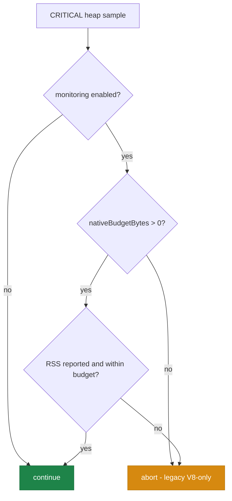

# Discovery #3022: AnalysisHeapGuard off-heap (RSS) awareness

## Summary

The discovery worker runs on a small default V8 heap (~269 MB). After the
recording phase the V8 heap fraction sits near the 85% critical threshold even
though the bulk of memory is native/Rust **RSS** with plenty of headroom (GRQ-23
observed `heap=231MB/269MB rss=13289MB`). `AnalysisHeapGuard` decided **solely**
on the V8 heap fraction, so a healthy run was mis-classified as CRITICAL and
analysis was aborted.

This change makes the guard off-heap aware while preserving genuine-OOM aborts:

- New `memory.nativeBudgetBytes` config (RSS budget in bytes). Default `0`
  disables off-heap awareness and preserves the legacy V8-only behaviour.
- `HeapGuardSample` widened with `rss` / `external`; `sampleHeapPressure`
  captures both (the default provider already exposes them via
  `Deno.memoryUsage()`).
- New pure, unit-testable `shouldAbortOnHeapPressure(sample, memoryConfig)`
  encodes the rule: a worker-V8-only CRITICAL does **not** abort while RSS is
  within `nativeBudgetBytes`; RSS over budget (or unreported) still aborts so a
  real OOM is never masked.
- Both discovery call sites now flow through it: `checkAnalysisHeapAbort`
  (`DataRecorder.ts` extension boundary) and `isHeapCritical`
  (`DataRecorderAnalysis.ts` in-loop guard). No V8-only abort decision remains
  on the discovery path.

Closes #3025.

## Acceptance criteria

- [x] Guard no longer aborts on worker-V8-only CRITICAL when configured native
      budget has headroom (covered by tests).
- [x] RSS-over-budget still aborts (no masking of real OOM).
- [x] Default/legacy behaviour preserved when no native budget is configured
      (`nativeBudgetBytes === 0`); `memory.enabled === false` still never trips.
- [x] Both call sites updated; no remaining V8-only abort decision on the
      discovery path.

## Decision flow



## Evidence

Backend/CLI change — no web interface to screenshot. Verified by unit tests
calling the real guard and config functions.

- `test/ErrorGuidedStructuralEvolution/AnalysisHeapGuard.ts`
  - `shouldAbortOnHeapPressure: V8-only CRITICAL within native budget does NOT abort`
  - `shouldAbortOnHeapPressure: RSS over native budget still aborts (genuine OOM)`
  - `shouldAbortOnHeapPressure: no native budget configured keeps legacy V8-only abort`
  - `shouldAbortOnHeapPressure: budget configured but RSS unreported falls back to abort`
  - `checkAnalysisHeapAbort: GRQ-23 V8-only CRITICAL within budget returns abort:false`
  - `checkAnalysisHeapAbort: RSS over budget still aborts and logs`
  - `isHeapCritical: V8-only CRITICAL within budget returns false`
  - `sampleHeapPressure: captures rss and external from the provider`
- `test/ErrorGuidedStructuralEvolution/AnalysisLoopHeapGuard.ts`
  - `in-loop heap guard: V8-only CRITICAL within native budget keeps the loop running`
  - `in-loop heap guard: RSS over native budget still aborts`
- `test/config/parsers/RuntimeParsers.ts`
  - `parseMemoryConfig - nativeBudgetBytes defaults to 0`
  - `parseMemoryConfig - applies nativeBudgetBytes override`
  - `parseMemoryConfig - rejects negative nativeBudgetBytes`

Command output (affected suites):

```
test/ErrorGuidedStructuralEvolution/AnalysisHeapGuard.ts        ok | 22 passed
test/ErrorGuidedStructuralEvolution/AnalysisLoopHeapGuard.ts    ok |  5 passed
test/ErrorGuidedStructuralEvolution/DiscoveryWorkerHeapLimit.ts ok |  3 passed (1 ignored)
test/config/parsers/RuntimeParsers.ts                           ok | 14 passed
```

`deno lint` (1727 files) and `./quality.sh --check-only` (type-check) both pass.

## Test Plan

- Added off-heap-awareness unit cases to `AnalysisHeapGuard.ts` (pure function,
  `checkAnalysisHeapAbort`, `isHeapCritical`, `sampleHeapPressure`).
- Extended the in-loop guard test `AnalysisLoopHeapGuard.ts` with the
  within-budget (no abort) and over-budget (abort) paths.
- Added config parser cases for `nativeBudgetBytes` default, override, and
  negative rejection.
- Existing guard tests (legacy V8-only behaviour, `memory.enabled === false`)
  and the `DiscoveryWorkerHeapLimit` regression cases remain green unchanged.

## Notes

- The complementary worker heap-limit propagation (the
  `DiscoveryWorkerHeapLimit` red→green switch) is a separate #3022 sub-issue;
  either approach alone stops the false abort. This PR takes the off-heap route
  and leaves that switch for its sibling PR.
