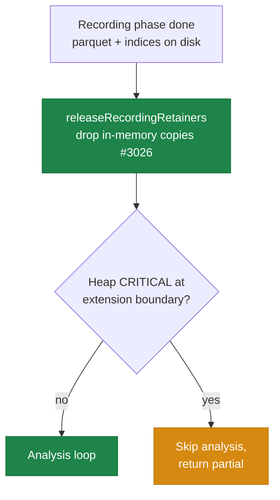

# Release record-phase JS retainers before the analysis heap check

## Summary

Sub-issue of #3022 — addresses **suspected root cause #3**: JS-side retainers
from the recording phase leave the worker heap near CRITICAL before analysis
even starts. Closes #3026.

By the time control reaches the analysis-extension boundary (`DataRecorder.ts`),
the recording phase has already persisted everything the analysis phase reads —
the merged `discovery_data.parquet` and the `selected_indices.json` written
during recording — yet its in-memory copies are still alive on the small default
worker V8 heap:

- `selectedIndices` — the per-file sampled-index map (the dominant retainer; it
  grows with every sampled record across every file),
- `rustAccumulatedData` / `rustAccumulatedNeuronData` — sample accumulators,
- `rustBinaryFilePaths` / `rustAccumulatedEstimatedBytes` — recording
  bookkeeping.

On their own these push the heap fraction the `AnalysisHeapGuard` samples
artificially toward the 85% CRITICAL threshold — not because analysis needs the
memory, but because record-phase retainers were never released.

### Change

- New `DiscoverStructure.releaseRecordingRetainers()`
  (`DiscoverStructureRecording.ts`) drops those in-memory copies and returns a
  small report (`releasedIndexEntries`, `releasedAccumulatedSamples`) for
  observability and tests. State the analysis phase still consumes is
  deliberately preserved: `recordedNeuronTotalAbsError` (focus ranking),
  `parquetFilePath`, `combinedRustAnalysis`, and `creature` — so there is no
  use-after-free.
- `DataRecorder` calls it on the `recordingSuccess` path, immediately **before**
  `checkAnalysisHeapAbort` samples the heap.
- Optional best-effort `globalThis.gc?.()` (reusing `attemptProactiveGc`) when
  `memory.proactiveGc` is enabled; correctness never depends on GC running.

This mirrors the per-chunk cache release of #2642
(`releaseCombinedRustAnalysisCache`) applied to the record→analysis handoff. It
reduces the demand side rather than raising the worker heap limit (the other
#3022 sub-issues), and is the lowest-risk, most local of the three.

## Evidence

Backend/memory change — no UI to screenshot. Verified by tests (below) and the
full quality gate (`./quality.sh`: **7305 passed, 0 failed, 4 ignored**).

Preserved across the release (no use-after-free): `recordedNeuronTotalAbsError`,
`parquetFilePath`, `combinedRustAnalysis`, `creature`.

## Test Plan

New `test/ErrorGuidedStructuralEvolution/ReleaseRecordingRetainers.ts`:

1. **`releaseRecordingRetainers empties record-phase state but preserves
   analysis state`**
   — records a representative batch against a named binary file, flushes, then
   asserts the release empties `selectedIndices`, `rustAccumulatedData`,
   `rustAccumulatedNeuronData`, `rustBinaryFilePaths` and zeroes
   `rustAccumulatedEstimatedBytes`, while `recordedNeuronTotalAbsError` and
   `parquetFilePath` survive unchanged. Also asserts a second release is a safe
   no-op.
2. **`releaseRecordingRetainers lowers the boundary heap sample below
   CRITICAL`**
   — models the boundary sample as `floor + retained-bytes` (the length-only
   modelling style of `DiscoveryWorkerHeapLimit`), injected through the
   `_setHeapGuardProviderForTests` seam. Before the release the sample is
   CRITICAL and `checkAnalysisHeapAbort` aborts; after the release `heapUsed` is
   measurably lower, the sample is below `criticalThreshold`, and the guard no
   longer aborts.

Regression-checked green: `AnalysisCacheRelease`, `DiscoveryWorkerHeapLimit`,
`AnalysisHeapGuard`, `AnalysisLoopHeapGuard`, `DiscoverStructureCleanUp` (33
passed), plus the full suite.

## Acceptance criteria

- [x] Record-phase retainers explicitly released before the extension-boundary
      heap sample in `DataRecorder`.
- [x] New test shows post-cleanup worker `heapUsed` is meaningfully lower /
      below CRITICAL for a representative (mocked) recording workload.
- [x] No change to recorded output — only in-memory copies of already-persisted
      data are dropped; no behavioural change when monitoring is disabled.
- [x] No use-after-free in the analysis loop — analysis-needed state preserved;
      existing analysis/cleanup tests stay green.
