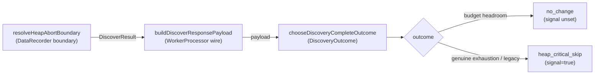

# Discovery #3027: integration guard for the heap-abort signal

## Summary

The discovery worker runs on a small default ~269 MB V8 heap, so after the
recording phase the V8 fraction sits near CRITICAL even when the host has ample
off-heap (native/Rust RSS) headroom. The off-heap-aware guard (#3025) already
prevents that false positive from aborting analysis. This issue **closes the
loop on the observable signal**: it proves end-to-end that
`heapAbortedAtExtensionBoundary` (and therefore the `"heap_critical_skip"`
training outcome) is emitted **only** for a genuine budget-exhaustion abort, and
adds the **integration guard** so the regression cannot silently return.

What changed:

- **Extracted `AnalysisExtensionBoundary.ts`** — a single source of truth for
  the empty `DiscoverResult` shape and the heap-abort boundary decision that
  `DataRecorder.recordFiles()` previously built inline in three duplicated
  branches. `resolveHeapAbortBoundary()` is the production function the
  integration test drives, so the test exercises real code rather than
  re-implementing the rule.
- **Refactored `DataRecorder`** to use `buildEmptyDiscoverResult()` (Rust
  unavailable / recording failed) and `resolveHeapAbortBoundary()` (heap-abort
  branch). Behaviour is unchanged; duplication is removed.
- **Added the integration guard** — `DiscoveryHeapAbortBoundaryIntegration.ts`
  composes the _real_ production functions across the whole wire path and
  asserts the explicit #3022 rule.

No guard-rule change lives here (that is #3025) and no existing tests were
removed or disabled.

Closes #3027.

## Evidence

This is a backend/library change with no web interface — evidence is the new
tests plus the existing suite passing (`7315 passed | 0 failed`).

### Signal wire path covered end-to-end

The integration test asserts the explicit rule as an assertion (not a comment):
_either_ the serialized worker heap sample is below CRITICAL at the boundary,
_or_ the guard does not abort while configured native-budget headroom exists —
in both legs the wire signal is unset and the outcome is not
`"heap_critical_skip"`.

### Manual acceptance checklist (external GRQ runner)

- [ ] GRQ-scale discovery (520 binary files, 5% sample on a 24 GB host) no
      longer logs `heap CRITICAL at extension boundary` immediately after a
      normal recording phase. (Operational; runs in the external runner, not
      in-repo CI.)

## Test Plan

- **`test/ErrorGuidedStructuralEvolution/DiscoveryHeapAbortBoundaryIntegration.ts`**
  (new):
  - worker-default-heap with native-budget headroom → no abort, wire signal
    `undefined`, outcome `"no_change"` (the #3022 false-positive case).
  - genuine budget exhaustion (RSS > budget) → field set, signal survives the
    worker serialization boundary, outcome `"heap_critical_skip"`.
  - legacy V8-only config (no native budget) → still aborts on CRITICAL across
    the wire (negative-path / no-regression).
- **`test/ErrorGuidedStructuralEvolution/AnalysisExtensionBoundary.ts`** (new):
  unit coverage for `buildEmptyDiscoverResult` (flag absent / set / false) and
  `resolveHeapAbortBoundary` (not-critical → null, legacy CRITICAL → aborted,
  budget headroom → null, monitoring disabled → null).
- Existing `AnalysisHeapGuard.ts`, `DiscoveryWorkerHeapLimit.ts`,
  `DiscoveryOutcome.ts`, and `WorkerProcessor.ts` tests still pass against the
  refactored `DataRecorder`.
- Full `./quality.sh` passes (fmt, lint, type-check, 7315 tests).
