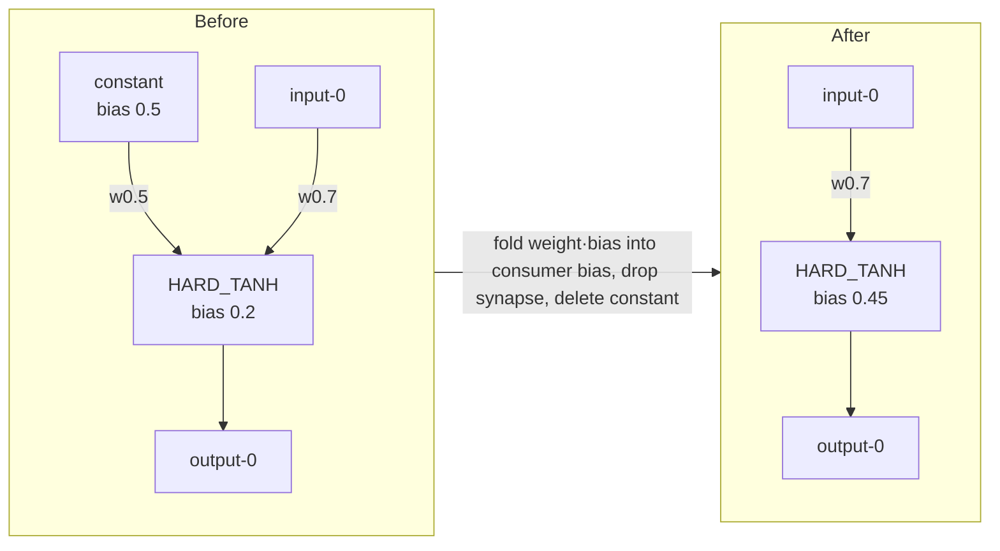

# Compaction: fold `type:"constant"` neurons into additive consumers (safe variant)

## Summary

Adds the production-derived regression fixtures and tests that lock in the
**safe constant fold** behaviour for `compactCreature`. Closes #3034.

The behaviour-preserving fold itself already lives in
`src/compact/ConstantFold.ts` (`foldConstants`, wired into
`src/compact/CompactCreature.ts`): a `type:"constant"` neuron emits the fixed
scalar `bias`, so for every **non-aggregate** consumer `B` the contribution
`weight · constant.bias` is folded into `B.bias` and the synapse is dropped;
once the constant has no remaining outbound synapses it is removed, while a
constant feeding an aggregate consumer (`MAXIMUM`/`MINIMUM`/`IF`/`HYPOT`/
`HYPOTv2`) is retained. This issue lands the **TDD fixtures** the acceptance
criteria require — two trimmed subgraphs drawn from the production creature
cited in #3029 — proving the safe fold on real network shapes.



## Evidence

Backend/compaction change — no UI to screenshot. Verified by unit tests that
call the real `compactCreature` pipeline and assert on folded biases, dropped
synapses, retained constants, output equivalence (~1e-6) and non-regressing
score.

New trimmed fixtures vendored into `test/data/`:

- `constant-fold-full-removal.json` — constant `legacy-neuron-1762683495` feeds
  only a `HARD_TANH` hidden neuron (`533d8616-…`).
- `constant-fold-partial-if.json` — constant `neuron-132866057` feeds an `IF`
  (aggregate) consumer plus a non-`IF` consumer.

Test run:

```
running 2 tests from ./test/compact/CompactCreatureConstantFold.ts
... full removal ... ok
... partial fold ... ok
ok | 2 passed | 0 failed
```

Full `./quality.sh` is green apart from a pre-existing stochastic flake
(`test/mutate/ModBiasRegularisation.ts` — a random 221-vs-279 L2 outcome,
unrelated to this change); it passes on re-run.

## Test Plan

Added `test/compact/CompactCreatureConstantFold.ts`:

1. **Full removal (HARD_TANH-only):** the constant folds into the HARD_TANH bias
   (`0.2 + 0.5·0.5 = 0.45`), its synapse is dropped, the constant is deleted,
   the HARD_TANH neuron survives (it keeps a varying input), outputs match
   within 1e-6 and score does not regress.
2. **Partial fold (IF + non-IF):** the non-IF synapse folds away
   (`0.1 + 0.4·0.5 = 0.3`), the IF synapse is kept, the constant is retained,
   outputs match within 1e-6 and score does not regress.

Existing `test/compact/CompactCreatureDisconnectedConstant.ts` behaviour is left
intact.
