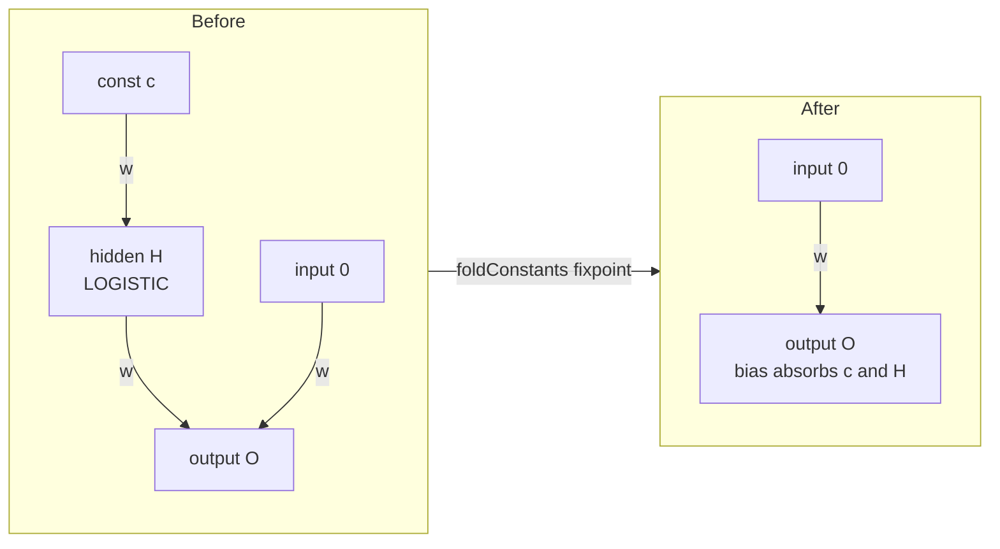

# Compaction: transitive constant fold + zero-varying-input collapse (safe variant)

## Summary

Extends the safe compaction variant with a **transitive constant fold** that
iterates to a **fixpoint** and a **zero-varying-input neuron collapse**. Both
transforms are lossless, so they belong to the safe variant. Closes #3035.

A new module `src/compact/ConstantFold.ts` exports `foldConstants()`, wired into
`compactCreature()` (`src/compact/CompactCreature.ts`) just before the parallel
bridge merges.

What it does:

- **Transitive fold (fixpoint).** A `type:"constant"` producer `C` emits the
  fixed scalar `C.bias`. For every non-aggregate consumer `B`, the contribution
  `weight · C.bias` is folded into `B.bias` and the synapse removed; when `C`
  has no consumers left it is deleted. Each fold can turn another neuron's
  inputs entirely constant, so the pass repeats until nothing changes.
- **Zero-varying-input collapse.** When a hidden neuron `H` has zero genuinely
  varying inputs (every input constant, or none at all), its output is the fixed
  scalar `squash(H.pre)` where `H.pre = Σ(weightᵢ · constantᵢ) + H.bias`. The
  squash is applied via the existing `Activations.find()` lookup (never
  hand-rolled). That scalar is folded downstream like a constant and `H`
  deleted.

Safety rules honoured:

- Only folds into **non-aggregate** consumers (`!isAggregationSquash`); a
  producer feeding an aggregate consumer (MAXIMUM/MINIMUM/IF/HYPOT/HYPOTv2) is
  retained for that consumer.
- A neuron is only treated as constant when it has **zero** varying inputs — any
  varying input means it is never constant.
- Only non-aggregate squashes (those exposing a scalar `squash(x)`) collapse.
- Never folds away an output neuron's last inbound synapse (structural
  validity).
- Frozen consumers/synapses (Issue #1861) are never modified.
- `didCompact` is set and `assertValidSynapseReferences` is asserted after the
  fold, consistent with the surrounding passes.



## Evidence

Backend/CLI change — no web interface to screenshot. Verified by unit tests
exercising real `compactCreature()` activation behaviour over random inputs.

New tests (`test/compact/CompactCreatureConstantTransitiveFold.ts`):

- **Transitive collapse:** `const → hidden(LOGISTIC) → output` with a separate
  varying input on the output. Asserts both the constant and the constant-fed
  hidden neuron disappear, outputs are preserved within `1e-6`, and the score is
  equal-or-higher.
- **Negative test:** a hidden neuron with one varying input and one constant
  input is **not** collapsed (it survives compaction); outputs preserved.

```
deno test test/compact/CompactCreatureConstantTransitiveFold.ts  ->  2 passed
deno test test/compact/*.ts                                      -> 144 passed
deno test test/compact/*.ts test/optimize/*.ts                   -> 154 passed
```

## Test Plan

- Added `test/compact/CompactCreatureConstantTransitiveFold.ts` (transitive
  collapse + negative no-collapse).
- Ran the full `compact` and `optimize` suites — no regressions.
- `./quality.sh` (fmt, lint, type-check, tests) green.
