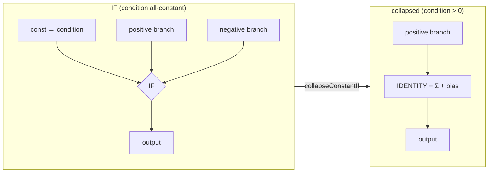

# Compaction: exact IF-collapse when all condition inputs are constant (safe variant)

## Summary

An `IF` neuron picks its branch by `condition = Σ(condition-type inbound
values)`, taking the positive branch when `condition > 0` else the negative
branch (`src/methods/activations/aggregate/IF.ts`). When **every**
condition-type input is constant, the selector is fixed at compaction time, so
the IF can be collapsed losslessly to its always-taken branch. This is exact, so
it belongs to the **safe** compaction variant.

New pass `collapseConstantIf` (`src/compact/IfCollapse.ts`):

1. Detects `squash === "IF"` neurons whose condition synapses (`type:"condition"`)
   all originate from constant neurons. Branch roles are read from the synapse
   `type` field exactly as `IF.ts` reads it — never from ordering. Constant
   detection reuses `computeConstantValues` (now exported from `ConstantFold.ts`),
   so both `type:"constant"` producers and effectively-constant hidden neurons
   count.
2. Computes the fixed `condition`; the taken branch is `positive` if
   `condition > 0`, else `negative`.
3. Keeps only the taken branch's inbound synapses, stripping their `type` so they
   become ordinary additive edges; drops the condition + untaken-branch synapses.
4. Rewrites the squash to `IDENTITY`, so the output becomes
   `Σ(taken-branch values) + bias` — identical to the IF's always-taken result.

The pass runs in `compactCreature` **before** the constant fold, so any constants
it strands are absorbed by the subsequent constant-fold round and orphan cleanup.
Frozen IF neurons / frozen inbound synapses are never modified; condition-less
(malformed) IFs are left for the IF-repair pass. Out of scope: speculative IF
pruning when condition inputs are *not* all constant (aggressive variant of #3029).

Closes #3036.

## Evidence

Backend/compaction change with no web interface — verified via unit tests and the
full quality gate (`./quality.sh`: **7281 passed, 0 failed**).

Regression linkage: with the new `collapseConstantIf` call removed from
`CompactCreature.ts`, the two collapse tests fail (IF squash stays `IF`); with it
wired in, all three pass. The negative test passes in both states, confirming
varying-condition IFs are untouched.

## Test Plan

Added `test/compact/CompactCreatureIfCollapse.ts` with fixtures under
`test/data/`:

- `if-collapse-positive.json` — `condition = 0.5 > 0` → collapses to the positive
  branch; asserts squash is no longer `IF`, only the varying positive synapse
  survives (additive, no `type`), condition/untaken constants are removed, lower
  neuron/synapse counts, outputs identical within `1e-6`, score ≥ original.
- `if-collapse-negative.json` — `condition = -0.5 ≤ 0` → collapses to the negative
  branch; same assertions for the other branch direction.
- `if-collapse-varying-condition.json` — **negative test:** the condition input
  varies, so the IF is left unchanged (squash stays `IF`, condition synapse
  retained), outputs identical.

All assert `creatureValidate({ forwardOnly: true })` (covering
`assertValidSynapseReferences`).
