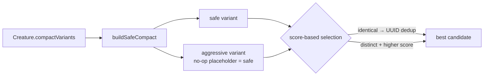

## Summary

Plumbing so compaction can surface **two** candidates — a **safe** compact (all
exact, behaviour-preserving folds; score guaranteed ≥ original) and an
**aggressive** compact (safe folds plus future extra structural pruning) — and
feed both into the existing score-based selection so the best wins. The
aggressive gamble can never cost anything because the safe variant is the floor.

In this issue the aggressive pass is a **no-op placeholder equal to the safe
variant** (the real heuristic lands in the aggressive-pruning sub-issue of
#3029). Identical variants dedupe via the existing UUID dedup, so the duplicate
is never scored. Closes #3037.

### Changes

- **New `compactCreatureVariants(creature, feedbackLoop, mcmcTemperature)`**
  (`src/compact/CompactCreature.ts`) returning `{ safe?, aggressive? }`. The
  existing compaction body moved into an internal `buildSafeCompact()` that
  produces the safe variant; `aggressive` is the no-op placeholder (same
  creature) for now.
- **Back-compat preserved**: `compactCreature()` and `Creature.compact()` are
  thin wrappers that return the safe variant. New `Creature.compactVariants()`
  exposes both.
- **New `src/compact/CompactVariants.ts`**: the `CompactVariants` type plus
  `selectCompactVariant()` — picks the best single candidate for call sites that
  consume one creature. The safe variant is the floor (wins ties, is the
  fallback); an aggressive variant only displaces it when it is a _distinct_
  creature (different UUID) with a strictly higher finite score. Identical
  variants return the safe one without scoring the duplicate.
- **All four call sites updated to offer both candidates to selection**:
  - `src/blackbox/FineTune.ts` (acceptCandidate path) — offers both variants;
    `acceptCandidate`'s UUID set dedupes the identical placeholder.
  - `src/architecture/training/TrainingTeardown.ts`
  - `src/architecture/training/TrainingPredictiveCoding.ts`
  - `src/propagate/RemoveSyntheticSynapses.ts`

  The latter three route through `selectCompactVariant()`, which returns the
  safe variant today — preserving current behaviour while the aggressive pass is
  identical/absent.

### Flow

## Evidence

Backend/compaction change only — no web interface to screenshot. Verified via
unit tests (`deno test`) and the full quality gate.

- New tests pass: `deno test test/compact/CompactCreatureVariants.ts` → 8/8.
- All compaction tests green: `deno test test/compact/*.ts` → 157/157.
- Call-site suites green: blackbox (82), `RemoveSyntheticSynapses` +
  `TrainingTeardown` + `PredictiveCodingTrainer` (20).
- Full `./quality.sh` ran fmt/lint/type-check + suite: **7288 passed**. The only
  failure was `test/mutate/ModBiasRegularisation.ts` — a pre-existing stochastic
  mutation test unrelated to compaction; it passes deterministically on re-run.

## Test Plan

Added `test/compact/CompactCreatureVariants.ts`:

- `compactCreatureVariants` returns both a safe and an aggressive candidate.
- `compactCreature` returns the safe variant (back-compat: same UUID as
  `variants.safe`).
- No-op aggressive pass dedupes to a single scored candidate via UUID (mirrors
  the call-site selection collapsing identical variants to one).
- `compactCreatureVariants` returns empty `{}` when nothing compacts.
- `selectCompactVariant` unit coverage: falls back to the present variant; keeps
  safe when variants are identical (distinct instances, same UUID); prefers a
  distinct strictly-higher-scoring aggressive; keeps safe on lower score or
  ties.
