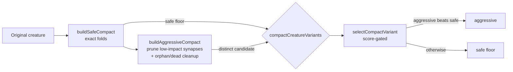

# Compaction: aggressive structural low-impact pruning pass (Issue #3038)

## Summary

Replaces the no-op aggressive placeholder from the two-variant plumbing
(#3037) with a real **aggressive** compaction pass. On top of the safe folds,
it speculatively prunes low-impact structure using a **purely structural,
dataset-free** heuristic and returns the result as a *candidate*. The existing
score-gated selection keeps the candidate only if it beats the safe variant, so
the safe variant remains the guaranteed floor and an over-eager prune costs
nothing. **No training data is threaded into `compactCreature`.**

Closes #3038.

### What changed

- **New `src/compact/AggressivePrune.ts`** — `aggressivePrune(export, threshold)`
  drops untyped synapses whose `|weight|` is below a small structural threshold
  (`AGGRESSIVE_PRUNE_WEIGHT_THRESHOLD = 1e-3`), **including** synapses feeding
  aggregate consumers (`MAXIMUM`/`MINIMUM`/`HYPOT`/`HYPOTv2`) and non-constant
  neurons — exactly the cases the exact/safe variant must leave untouched.
  Safety rules mirror the safe pass: frozen synapses, typed synapses
  (IF roles), and synapses into IF neurons are never pruned, and every output
  keeps at least one inbound edge.
- **`src/compact/CompactCreature.ts`** — `compactCreatureVariants` now builds
  the aggressive candidate on top of the safe variant via `buildAggressiveCompact`:
  prune low-impact synapses, then run the existing orphan / dead-subgraph
  cleanup, and return a distinct creature only when the prune changed the
  structure (otherwise the variants dedupe by UUID exactly as before).

### Why it is safe

- Aggressive = safe folds + extra pruning, so it is never structurally worse
  than safe.
- Pruning only removes synapses (never adds), so it cannot introduce backward
  edges — no `feedbackLoop` handling is required.
- The heuristic is dataset-free (synapse-weight magnitude only); the candidate
  is score-gated by population selection.

## Evidence

Backend/library change with no web interface — verified via unit tests
(`deno test`) and the full `./quality.sh` gate. Key behaviours covered:

- `aggressivePrune` drops a low-impact synapse feeding a `MAXIMUM` aggregate.
- Frozen low-impact synapses and an output's last inbound edge are preserved.
- Via `compactCreatureVariants`, the aggressive variant has strictly fewer
  synapses than the safe variant on a fixture where the safe pass keeps a
  low-impact synapse.
- The safe variant's UUID is identical with or without the aggressive pass.
- A harmful prune (lower score) is rejected by `selectCompactVariant`, which
  falls back to the safe floor.

## Test Plan

Added `test/compact/CompactCreatureAggressivePrune.ts`:

- `aggressivePrune drops a low-impact synapse feeding a MAXIMUM aggregate`
- `aggressivePrune never touches a frozen low-impact synapse`
- `aggressivePrune keeps an output's last inbound edge`
- `compactCreatureVariants: aggressive prunes a synapse the safe variant keeps`
- `compactCreatureVariants: the safe variant is unchanged by the aggressive pass`
- `compactCreatureVariants: a harmful aggressive prune is rejected by selection`
- `compactCreatureVariants: aggressive equals safe when nothing is low-impact`

Existing `test/compact/CompactCreatureVariants.ts` continues to pass unchanged.
