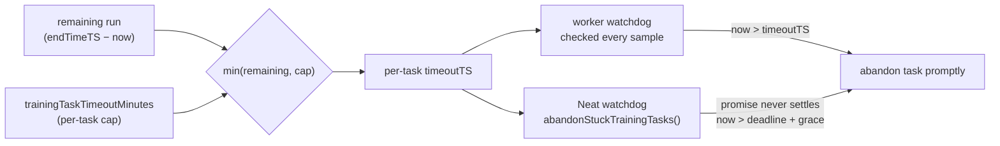

## Summary

Individual NEAT-AI training tasks were allowed to run for the **entire remaining
run budget** rather than a small per-task wall-clock cap, and a task's timeout
was only evaluated once every ~60 seconds (behind the progress-log gate). On the
GRQ run cited in the issue, nine training tasks each ran 9–13 minutes before
timing out — a handful of slow/stuck tasks dominated the wall-clock budget.

This PR caps the per-task wall-clock budget and tightens the watchdog cadence so
no single task can exceed a small, configurable bound. **Closes #3053.**

What changed:

- **New `trainingTaskTimeoutMinutes` option** (`src/config/NeatArguments.ts`,
  `NeatOptions.ts`, `NeatConfig.ts`) — caps the wall-clock budget of any single
  training task independent of the overall `timeoutMinutes` run budget. Default
  `5`; `0` disables the cap (restores prior behaviour). This unblocks the GRQ
  follow-up, which can set a tighter cap.
- **`computePerTaskTimeoutMinutes`** (`src/NEAT/PerTaskTrainingTimeout.ts`) — a
  pure helper deriving the per-task budget as
  `min(remainingRunMinutes, trainingTaskTimeoutMinutes)`, preserving the
  existing `-1` "no remaining budget" sentinel and the `0` "no run deadline"
  case. Wired into the `scheduleTraining` call in `src/NEAT/NeatEvolution.ts`.
  Discovery scheduling is untouched — only per-task training is capped.
- **Per-sample watchdog** (`src/architecture/training/TrainingEpoch.ts`) — the
  `timeoutTS` check now runs on every sample, not only behind the 60s
  progress-log gate, so a task that exceeds its cap is abandoned promptly
  instead of overrunning by up to a full sample batch + 60s. The worker resolves
  the training promise on timeout, which clears the task from
  `trainingInProgress` incrementally rather than only in the hard-deadline
  batch.
- **Incremental Neat-level watchdog** (`src/NEAT/Neat.ts`,
  `src/NEAT/NeatScheduling.ts`) — covers the case the worker-side check cannot:
  a task whose worker promise **never settles**. Each in-flight task's per-task
  deadline is tracked in a new `trainingDeadlines` map (set in
  `scheduleTraining`, cleared on completion/failure);
  `Neat.abandonStuckTrainingTasks()` (swept at the start of each finish-up
  cycle) abandons each overrun task individually plus a small grace, instead of
  the single batch clear at the hard deadline. The pure deadline check
  (`isPastTrainingDeadline`) and grace constant live alongside the cap helper in
  `PerTaskTrainingTimeout.ts`.

### Acceptance criteria

- ✅ No single training task can exceed a budget-derived wall-clock cap
  (`min(remaining, trainingTaskTimeoutMinutes)`, default 5 min — well under the
  10–13 min runaways).
- ✅ Stuck tasks are abandoned promptly: the per-task deadline is checked every
  sample (worker-side watchdog) and the resolved promise clears the in-flight
  task immediately; an incremental Neat-level watchdog
  (`abandonStuckTrainingTasks()`) also abandons never-settling tasks
  individually rather than in a single batch at the hard deadline.
- ✅ A new `NeatOption` (`trainingTaskTimeoutMinutes`) lets consumers set the
  per-task cap independent of `timeoutMinutes`.

### Evidence

Backend/engine change — no UI to screenshot. Verified via the test suite and the
full quality gate (`./quality.sh`: 7350 passed, 0 failed).

The watchdog regression test drives a past deadline (`hardDeadlineTS: 1`) and
asserts training stops on the first iteration. Against the old 60s-gated code a
tiny dataset never reaches 60s, so the timeout would never fire and the loop
would run all requested iterations — the test would fail, confirming it is a
genuine regression test for the tightened cadence.

## Test Plan

- `test/NEAT/PerTaskTrainingTimeout.ts` — unit tests for
  `computePerTaskTimeoutMinutes`: cap clamps a large remaining run, remaining
  wins when smaller, no cap returns remaining unchanged, `-1` sentinel
  propagates, `0` remaining uses the cap, fractional caps round up with a
  1-minute floor.
- `test/config/TrainingTaskTimeoutMinutes.ts` — `createNeatConfig` default (5),
  override, `0` disables, CLI string coercion, rejects negatives.
- `test/architecture/training/TrainingTaskWatchdog.ts` — behavioural: an
  already-expired deadline stops training on the first iteration; with no
  deadline the loop runs the full iteration budget.
- `test/NEAT/PerTaskTrainingTimeout.ts` (extended) — `isPastTrainingDeadline`
  trips only past deadline + grace, ignores a non-positive deadline, and
  defaults to the watchdog grace constant.
- `test/NEAT/NeatStuckTaskWatchdog.ts` — `abandonStuckTrainingTasks` abandons
  only the overrun task, respects the grace window, and ignores a `0` deadline
  (clock-injected, behavioural assertions per #2888).
- Full `./quality.sh` gate: format, lint, type-check, and all tests (7350
  passed, 0 failed).
