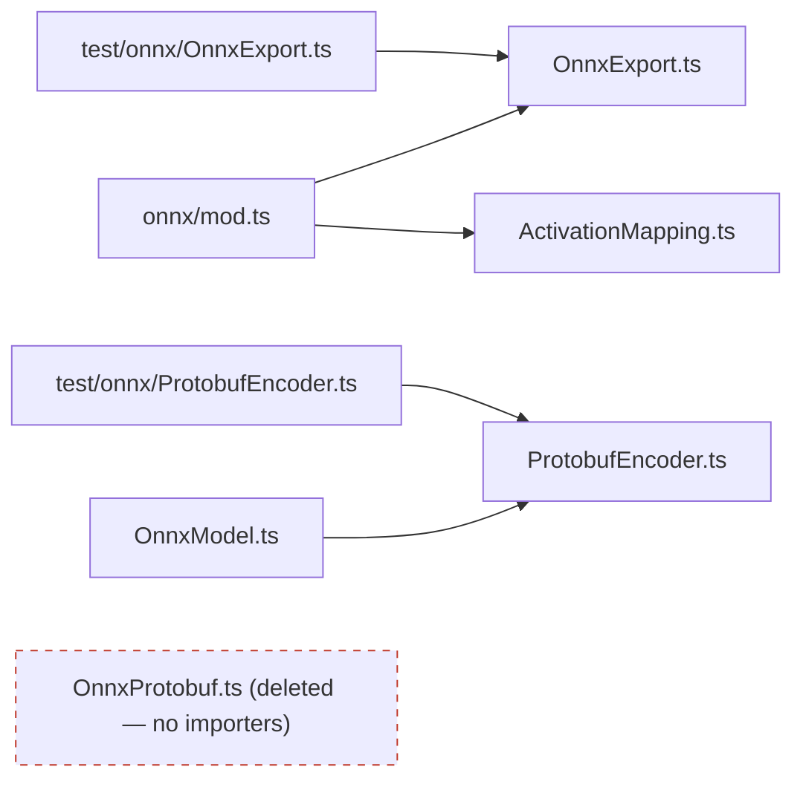

# Remove dead-code module `src/onnx/OnnxProtobuf.ts`

## Summary

Static dead-code analysis flagged the exported function `encodeModelProto` (at
`src/onnx/OnnxProtobuf.ts:372`) as having no in-repo importer. Investigation
confirmed the **entire module** is orphaned: it is the call-tree root of a
self-contained ONNX protobuf-encoding cluster (8 `encode*` functions plus the
`ONNX_TENSOR_TYPE` const) that nothing references. This PR deletes the whole
file. Closes #3060.

Verification before deleting:

- `rg "OnnxProtobuf"` across `*.ts`, `*.js`, `*.json`, `*.sh` — **zero**
  importers, zero dynamic `import()`, zero build/config references.
- Every exported symbol (`encodeModelProto`, `encodeTensorProto`,
  `encodeAttributeFloat/String/Int`, `encodeNodeProto`, `encodeValueInfoProto`,
  `encodeGraphProto`, `ONNX_TENSOR_TYPE`) — **no** usage outside the module.
- `src/onnx/mod.ts` re-exports `OnnxExport.ts` and `ActivationMapping.ts` but
  **not** `OnnxProtobuf.ts`; the root `mod.ts` exposes only `exportToOnnx` /
  `checkOnnxCompatibility`.
- The module imports nothing, so deletion leaves no dangling imports.
- The live ONNX export path uses the sibling `ProtobufEncoder.ts` (imported by
  `src/onnx/OnnxModel.ts`, covered by `test/onnx/ProtobufEncoder.ts`) —
  `OnnxProtobuf.ts` was a superseded duplicate.

## Evidence

Backend/library change with no web interface — no screenshot applicable.

Confirmation that the live ONNX path is unaffected:

Quality gate after deletion:

- `./quality.sh` — **7356 passed, 0 failed, 4 ignored**.
- `./quality.sh --check-only` (lint + format + type-check) — exit 0.

## Test Plan

No new tests are added: this is a pure dead-code removal with no behavioural
change, and the project guidelines forbid grep-on-source "how" tests. The
existing ONNX suites continue to exercise the live export path and all pass:

- `test/onnx/ProtobufEncoder.ts` — the live `ProtobufWriter` encoder used by
  `OnnxModel.ts`.
- `test/onnx/OnnxExport.ts` — the public `exportToOnnx` /
  `checkOnnxCompatibility` API.

Full suite (7356 tests) passes after the deletion, confirming nothing depended
on the removed module.
