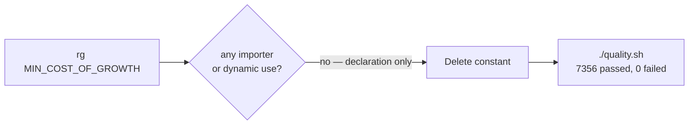

# 🟢 dead-code: remove unused export `MIN_COST_OF_GROWTH`

## Summary

Static dead-code analysis flagged `MIN_COST_OF_GROWTH` in
`src/config/NeatConfig.ts` as an unused export. A full-repo search
(`rg "MIN_COST_OF_GROWTH"` plus a broader `costOfGrowth` / `COST_OF_GROWTH`
sweep) confirmed the constant appeared only at its own declaration — no
importer, no `mod.ts` re-export, and no string-keyed/dynamic config lookup
referencing it. It is a genuinely dead config constant, so it has been removed
along with its doc comment. Closes #3064.

## Evidence

This is a backend/library change with no web interface to screenshot.
Verification was via the project quality gate:

- `./quality.sh` passed cleanly: **7356 passed | 0 failed | 4 ignored**.
- `deno lint` (unused-symbol detection) and `deno check` (type-check) both pass
  with the constant removed, confirming nothing in the tree consumed it.

## Test Plan

No new test was added: an "absence of export" assertion would be a structural
("how") test, which the project's testing policy disallows. The existing quality
gate is the correct verifier here — `deno lint` and `deno check` fail on a
dangling reference, and the full test suite (7356 tests) confirms no behavioural
regression. This mirrors the prior dead-code removals (#3060, #3061, #3062).
