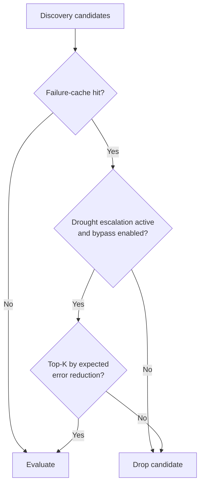

# Discovery failure-cache bypass during drought escalation

## Summary

`CandidateFiltering.ts` dropped failure-cache hits _before_ Phase-1 evaluation
regardless of the Rust-side drought state, so a plateaued creature whose
candidates were all in the failure cache could go weeks without a single
candidate reaching evaluation (observed on GRQ-3).

This change lets discovery bypass the failure cache for the highest-value
candidates while a drought escalation is active:

- When the Rust discovery engine signals a drought — `noveltyEscalationActive`
  or `creatureDroughtAlarm` (NEAT-AI-Discovery #1423) — and the new
  `discoveryFailureCacheBypassOnDrought` option is enabled (default `true`), the
  top-K cached candidates (ranked by `expectedErrorReduction`, K scaling with
  the worker thread count) are re-admitted for evaluation instead of being
  dropped.
- The bypass is logged as
  `[DiscoveryRunner] failure-cache bypass: N candidates re-evaluated (drought escalation)`.
- `discoveryFailureCacheBypassOnDrought` is exposed on `NeatOptions` /
  `NeatArguments` and defaults to `true`.

When no drought is active, behaviour is unchanged: failure-cache hits are still
dropped before slot allocation.

Closes #3072.

## Changes

- `src/discovery/CandidateFiltering.ts` — drought bypass selecting top-K cached
  candidates; `failureCacheBypass` diagnostics + log line.
- `src/discovery/DiscoveryRunner.ts` — map drought metadata from the discovery
  result and thread `droughtEscalationActive` through both filter call sites.
- `src/config/NeatArguments.ts` + `src/config/NeatConfig.ts` — new
  `discoveryFailureCacheBypassOnDrought` option (default `true`).
- `src/architecture/ErrorGuidedStructuralEvolution/DiscoverResult.ts` — optional
  `noveltyEscalationActive` / `creatureDroughtAlarm` metadata fields.
- `docs/config/DISCOVERY.md` — documents the option and the bypass flow.

## Evidence

Backend/library change with no web interface — verified via automated tests and
the project quality gates (`./quality.sh --check-only` and `--lint-only` both
pass clean across the project).

## Test Plan

Unit — `test/discovery/CandidateFilteringDroughtBypass.ts`:

- drought bypass re-admits cached candidates for evaluation
- bypass selects the highest-value cached candidate (top-K = 1)
- top-K scales with thread count
- no bypass when drought escalation inactive
- no bypass when the option is disabled even during drought
- non-cached candidates are unaffected by the bypass
- `discoveryFailureCacheBypassOnDrought` defaults to `true`

Integration (real Rust FFI failure cache) —
`test/discovery/DiscoveryRunnerDroughtBypass.ts`:

- creature with a full failure cache + drought counter → ≥1 candidate
  re-evaluated (acceptance criterion 1); same candidate stays skipped without
  drought
- with bypass disabled, the cached candidate stays skipped even during drought

All 563 `test/discovery/*.ts` tests pass, plus the configuration-guide defaults
suite.
