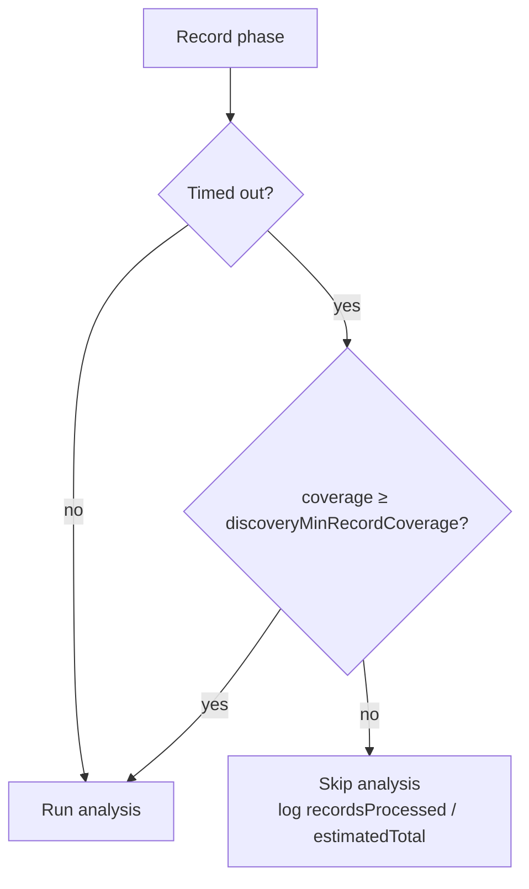

# Discovery record-phase coverage guard (Issue #3073)

## Summary

On a large dataset (GRQ-3: 520 binary training files at a 5% sample) the
discovery **record phase** times out after sampling only a fraction of the
expected records (~1766 of ~8353). Previously NEAT-AI proceeded to a **full
analysis pass on that sparse partial data**, burning the analysis budget and
producing zero-candidate passes.

This change adds a **record-coverage guard**. When the record phase times out
having captured less than a configurable fraction of the dataset, analysis is
**skipped with a clear, logged reason** instead of running on insufficient data.
The recorder also now logs `recordsProcessed / estimatedTotal` at the record
timeout so a truncated recording is visible in the logs.

Note: the issue's premise that the default record timeout is **2 minutes** is
stale — it was already raised to **5 minutes** in #1386. The real fix is the
coverage guard, which satisfies the acceptance criterion's second clause
("analysis is skipped with a clear reason").

Closes #3073.

### What changed

- **New pure helper** `RecordCoverage.ts` — `estimateTotalRecords`,
  `computeRecordCoverage`, `shouldSkipAnalysisForCoverage`,
  `formatRecordCoverage`. Extrapolates the dataset's expected record total from
  the files processed so far (no extra I/O) and decides whether coverage is high
  enough for analysis.
- **`DataRecorderRecording.ts`** — records `totalFiles` and `recordTimedOut` on
  the perf stats, and logs `recordsProcessed / estimatedTotal` at the timeout.
- **`DataRecorder.ts`** — after a successful (possibly partial) recording, the
  coverage guard skips analysis and returns the existing empty-result shape when
  a timeout left coverage below the threshold.
- **Config** — new `discoveryMinRecordCoverage` option (default **0.5**, range
  0–1; `0` disables). Wired through `NeatArguments`, `NeatOptions`, and
  `createNeatConfig`.
- **Docs** — `docs/config/DISCOVERY.md` and `docs/api/CONFIGURATION.md`.

The guard is intentionally narrow so it never changes behaviour for a recording
that finished normally:

- It only fires on a **genuine record-phase timeout**.
- It only fires when **part of a multi-file dataset** was left unread — a
  completed recording, or a single-file dataset (where the total cannot be
  estimated), is treated as full coverage and always analyses.
- `discoveryMinRecordCoverage = 0` disables it entirely.

### Evidence

Backend/CLI change — no web interface to screenshot. Verified via unit tests
(below). Decision flow:



Test run:

```
test/ErrorGuidedStructuralEvolution/RecordCoverage.ts ... 13 passed
test/config/ConfigurationGuideDefaults.ts ............... 12 passed
```

## Test Plan

- **`test/ErrorGuidedStructuralEvolution/RecordCoverage.ts`** (new) — covers:
  - `estimateTotalRecords` extrapolation (GRQ-3 shape ~1766/110 files → ~8350),
    plus the no-files-processed, all-files-processed, and never-below-recorded
    edge cases.
  - `computeRecordCoverage` fraction stays within [0, 1].
  - `shouldSkipAnalysisForCoverage`: skips a heavily-truncated timeout (21% <
    50%); runs analysis on a completed recording; never skips a non-timeout;
    runs when coverage clears the bar (90%); skips when a timeout recorded
    nothing; disabled at threshold 0; single-file timeout immune.
  - `formatRecordCoverage` renders records, estimate, and percentages.
- **`test/config/ConfigurationGuideDefaults.ts`** (updated) — asserts the new
  `discoveryMinRecordCoverage` default is `0.5`.

## Security self-check

Backend config/logic change. New config value validated via `parseNumber` with
`{ min: 0, max: 1 }`. No new I/O, injection surface, secrets, or external calls.
No hidden files staged.
