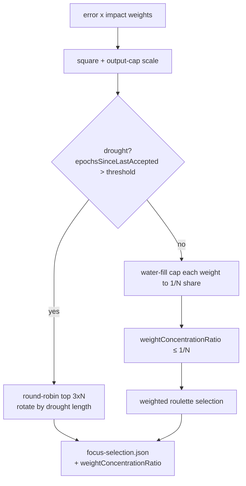

# Discovery focus-selection diversity floor (#3074)

## Summary

On a plateaued network the squared `error × impact` weighting in the discovery
focus-selection roulette let a single neuron capture almost all of the wheel
(~98% on the GRQ-3 fixture, 1673 neurons). Six neurons were nominally selected
but the search effectively repeated the same target.

This change adds a **diversity floor** to the TypeScript roulette path:

1. **Water-fill cap.** Each neuron's roulette weight is iteratively clipped down
   to at most a `1/N` share of the total (`N` = candidate count). At the fixed
   point the heaviest neuron holds no more than `1/N` of the wheel, so it can no
   longer dominate, while sub-mean weights keep their relative ordering. This
   replaces a naive single-pass clip, which did not bound concentration when the
   tail mass was smaller than the mean.
2. **Concentration metric.** `weightConcentrationRatio` (heaviest neuron's share
   of the floored weight, in `[0, 1]`) is recorded in `focus-selection.json` and
   on the focus-selection summary, and surfaced in the discovery analysis logs
   with a ⚠️ marker when it stays ≥ 0.5.
3. **Drought round-robin.** When `epochsSinceLastAccepted` exceeds the drought
   threshold (default 20), selection abandons roulette and rotates
   deterministically through the top `3×count` ranked neurons, with the start
   offset advanced by the drought length so successive plateaued epochs explore
   distinct targets. This is exposed via an optional `diversity` argument on
   `selectNeuronsWeightedByError`.

The cap is always on and solves the production concentration problem; the
round-robin is an optional, drought-gated path.

Companion work: NEAT-AI-Discovery #1445 (Rust ranking diversity), GRQ #2764.

Closes #3074.

## Evidence

This is a backend/library change with no web interface, so evidence is the unit
test suite (`test/discovery/FocusSelectionDiversityFloor.ts`). The acceptance
criteria are verified directly:

- **GRQ-3 fixture** (1673 neurons, one holding ~98% pre-floor): the recorded
  `weightConcentrationRatio` drops to ≈ `1/1673` — well below the `< 0.5`
  target.
- **Synthetic dominant neuron** (50 candidates): pre-floor share `> 0.9`,
  post-floor `weightConcentrationRatio < 0.5`.

## Test Plan

New tests in `test/discovery/FocusSelectionDiversityFloor.ts` (pure "what"
tests, no Rust/WASM required — they call the real `selectNeuronsWeightedByError`
and assert on its output and the analysis JSON it writes):

- `Diversity floor keeps weight concentration below 0.5 on a synthetic dominant
  neuron`
  — post-floor ratio `< 0.5`, pre-floor share `> 0.9`.
- `Diversity floor bounds concentration on a GRQ-3 sized pool (1673 neurons)` —
  acceptance fixture, ratio `< 0.5`.
- `Diversity floor is a no-op for an already uniform distribution` — ratio
  `1/N`.
- `Drought triggers deterministic round-robin across distinct top-ranked
  neurons`
  — mode `round-robin`, 6 distinct neurons selected.
- `Round-robin offset rotates with the drought length` — different drought
  lengths yield different focus lists.
- `No drought (epochs below threshold) keeps the weighted roulette path`.

All existing focus-selection tests continue to pass, and the full `./quality.sh`
gate (fmt, lint, type-check, tests) was run.

### Note on field naming

The new JSON field is camelCase `weightConcentrationRatio` to match the existing
`focus-selection.json` schema (`totalWeightedSum`, `selectionMethod`, …); the
issue's `weight_concentration_ratio` is the snake_case Rust-side spelling of the
same metric.
