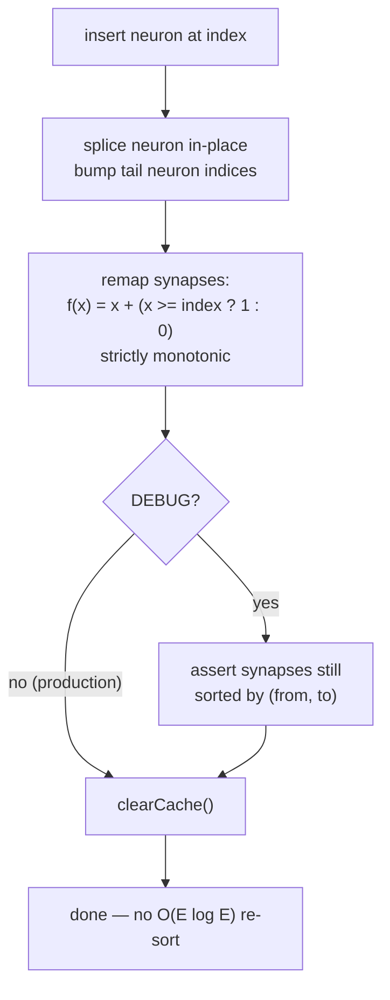

# perf: Remove redundant full synapse re-sort in AddNeuron.insertNeuron

## Summary

`AddNeuron.insertNeuron` re-sorted the **entire** synapse array on every
ADD_NODE mutation, but the preceding index remap cannot change the sort order —
so the `O(E log E)` sort was redundant work on a per-genome, per-generation hot
path. This PR removes the re-sort, guards the ordering invariant with a
debug-only assertion, and replaces the slice/spread neuron rebuild with an
in-place `splice`. Closes #3083.

Why the sort is provably unnecessary: after inserting a neuron at
`neuron.index`, every synapse coordinate `>= index` is incremented. That is the
map `f(x) = x + (x >= index ? 1 : 0)`, which is **strictly monotonic
increasing**. Applying it to both `from` and `to` preserves the lexicographic
`(from, to)` ordering — a sorted array stays sorted, so the `sort()` re-built an
order that was never disturbed.

### Changes

1. Removed the `this.creature.synapses.sort(...)` call from `insertNeuron`.
2. Added a debug-only guard `assertSynapsesSortedByFromTo`
   (`src/architecture/SynapseOrderGuard.ts`) — gated on `creature.DEBUG`, so it
   adds **zero** cost to the production hot path while catching any future code
   path that violates the ordering invariant during tests.
3. Replaced the `slice(0,index)` / `slice(index)` /
   `[...left, neuron, ...right]` triple-allocation neuron rebuild with a single
   in-place `neurons.splice(neuron.index, 0, neuron)` plus the existing
   tail-index bump.

### Behaviour change

`insertNeuron` drops from `O(E log E)` to `O(E)` per insertion. The ordering of
`creature.synapses` is unchanged (still sorted by `(from, to)`); only the
redundant work is removed.

## Evidence

Backend/CLI change — no web interface to screenshot. Verified via the new
micro-benchmark and the existing + new unit tests.

### Benchmark (before/after)

`bench/mutate/AddNeuronInsertResort.ts` builds a large, dense creature and times
many ADD_NODE mutations (`deno run -A bench/mutate/AddNeuronInsertResort.ts`).
Averages of three runs each, `creature.DEBUG` off (production path):

| Scenario             | Synapses (end) | Mutations | Before (avg/mutation) | After (avg/mutation) | Improvement |
| -------------------- | -------------- | --------- | --------------------- | -------------------- | ----------- |
| 20in/5out/100hidden  | 1100           | 200       | ~426 µs               | ~410 µs              | ~3.7%       |
| 40in/10out/200hidden | 2600           | 300       | ~1.045 ms             | ~1.000 ms            | ~4.3%       |

The saving is consistent across runs (outside measurement noise) and grows with
synapse count `E`, matching the `O(E log E) → O(E)` reduction. Ordering and
`creatureValidate` checks pass in every run.

## Test Plan

- Added `test/mutate/AddNeuronSynapseOrder.ts`:
  - `AddNeuron - synapses stay sorted by (from, to) after insertion` — runs 60
    ADD_NODE mutations on a dense creature and asserts the `(from, to)` ordering
    invariant holds after each (catches a regression if the remap ever stops
    preserving order).
  - `assertSynapsesSortedByFromTo - passes on a correctly ordered creature`.
  - `assertSynapsesSortedByFromTo - throws when DEBUG and order broken`.
  - `assertSynapsesSortedByFromTo - no-op when DEBUG is false`.
- Existing `test/mutate/AddNeuron.ts` (8 tests) pass unchanged, confirming
  mutation correctness and `creatureValidate` still hold.
- Full quality gate (`./quality.sh`) passes: **7389 passed, 0 failed**.
