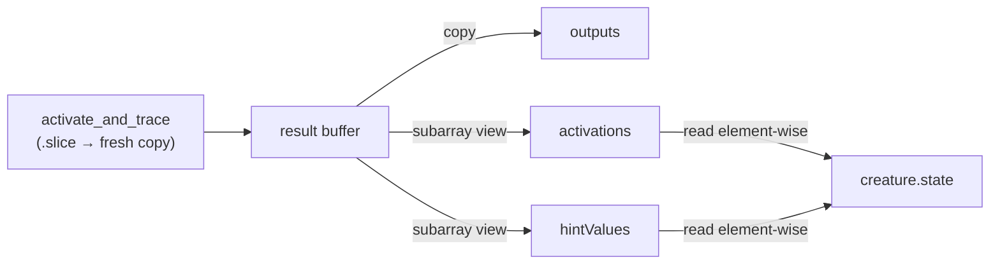

# perf: Return zero-copy views from WASM `activateAndTrace`

## Summary

`WasmCreatureActivation.activateAndTrace` allocated **two** throwaway
`Float32Array`s per call (`activations`, `hintValues`) and bulk-copied WASM
result slices into them, only for the consumer in `CreatureActivation.ts` to
read those arrays straight back out element-wise into `creature.state`. On the
dominant per-sample backprop training path this is pure wasted work.

This change returns `activations` and `hintValues` as zero-copy `subarray`
**views** into the single per-call `result` buffer — no allocation, no copy.
`outputs` stays a standalone copy because it is returned to external callers who
may retain it (keeping it small avoids pinning the whole `result` buffer alive).

**Correctness — the one sensitive step (verified):** the WASM binding
`activate_and_trace` (`wasm_activation/pkg/wasm_activation.js:83`) `.slice()`s
the WASM linear-memory slice before returning, so `result` is a fresh per-call
copy, **not** a live view that a later call would overwrite. Taking `subarray`
views into it is therefore safe.

Closes #3085.

## Evidence

Backend/WASM change — no UI to screenshot.

### Benchmark (before/after) — `bench/ActivateAndTraceBulkCopy.ts`

Added an `extract-strategy` group contrasting the old copy-return against the
new view-return on an identical production-scale `result` buffer (1000
iterations/run, Apple M4 Pro, Deno 2.8.3):

| benchmark                          | time/iter (avg) | iter/s | result           |
| ---------------------------------- | --------------- | ------ | ---------------- |
| Extract: copy-return [old]         | 1.1 ms          | 912.4  | baseline         |
| Extract: view-return [Issue #3085] | 503.9 µs        | 1,985  | **2.17× faster** |

Removing the 2 allocations + 2 bulk copies per call roughly halves the
extraction cost and cuts GC pressure on the hot path.

### Data flow

## Test Plan

- Added `test/wasm/ActivateAndTraceViewReturn.ts`:
  - `numeric outputs are correct` — verifies
    `outputs`/`activations`/`hintValues` against a hand-computed known network
    (numeric parity unchanged).
  - `earlier result survives a later call (per-call buffer)` — retains the first
    call's views, runs a second activation with different input, and asserts the
    first result is unchanged. This guards against a regression to aliasing live
    WASM memory.
- Existing trace/backprop suites continue to pass (`WasmBackpropagation.ts`,
  `ActivateAndTraceBatch4Way.ts`, `test/propagate/*`).
- Full `./quality.sh` gate: **7392 passed, 0 failed**.
