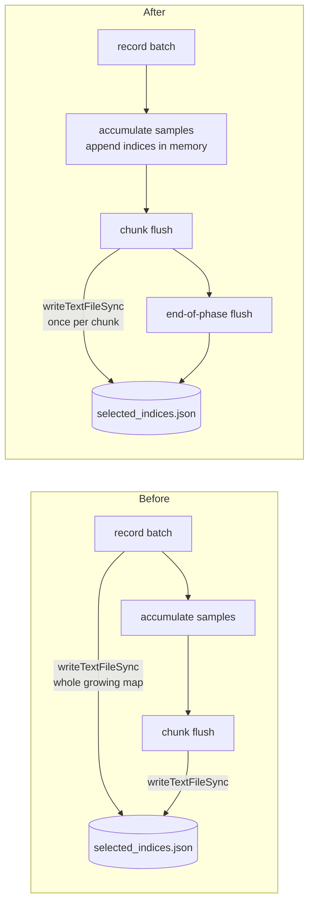

# perf: Drop per-batch synchronous re-serialisation of the discovery selected-indices map

## Summary

During discovery recording, `DiscoverStructureRecording.record()` synchronously
re-serialised and rewrote the **entire** selected-indices map to disk on **every**
batch via a blocking `Deno.writeTextFileSync`. The map grows monotonically across
the whole recording phase, making this an `O(batches × total_indices)`
blocking-I/O cost on the dominant phase for large datasets.

The write was redundant: `writeRustParquetChunk` already persists the same
`selected_indices.json` atomically alongside **every** parquet chunk flush, and
`flushRustRecording` covers the end of the recording phase. The analysis phase
only reads `selected_indices.json` *after* recording completes
(`DiscoverDataLoading.ts`), never an intermediate version.

This change removes the per-batch write from `record()`. Persistence is now
provided solely by the per-chunk flush write plus the single end-of-phase flush —
which also keeps the indices map and the parquet chunks written together in sync.

Closes #3086.

## Change



- `src/architecture/ErrorGuidedStructuralEvolution/DiscoverStructureRecording.ts` —
  removed the per-batch `Deno.writeTextFileSync`; in-memory `appendAll` of the
  selected indices is retained, persistence deferred to chunk flush.

## Evidence

Backend-only change — no UI to screenshot.

### Benchmark (`bench/DiscoveryIndicesPersistence.ts`)

Models the two persistence strategies on a representative recording workload
(256 batches × 128 indices, chunk flush every 16 batches):

| Strategy | time/iter (avg) | iter/s |
| --- | --- | --- |
| per-batch write (**before**) | 161.9 ms | 6.2 |
| per-flush write (**after**) | 4.1 ms | 241.9 |

**~39× faster** for the modelled workload (the blob rewritten each batch keeps
growing, so the saving compounds with longer recording phases). Run with:

```bash
deno bench --allow-read --allow-write bench/DiscoveryIndicesPersistence.ts
```

## Test Plan

- Added `test/discovery/DiscoverStructureRecordIndices.ts` →
  `"DiscoverStructure: record() defers indices persistence to chunk flush (Issue #3086)"`:
  - asserts `initialize()` seeds an empty map on disk;
  - drives two `record()` batches **without** an intervening flush and asserts the
    on-disk `selected_indices.json` is still the seeded empty map (regression
    guard — fails if the per-batch write is reintroduced);
  - asserts a chunk flush then persists the complete, correct map with absolute
    index offsets preserved.
  - Verified the guard **fails** against the old per-batch-write behaviour and
    **passes** with the fix (TDD).
- Existing discovery recording/flush tests
  (`DiscoverStructureRecordIndices.ts`, `DiscoveryRustFlush.ts`) continue to pass —
  the final indices file is still complete and the analysis phase still loads it.
- Full quality gate: `./quality.sh` — 7396 passed, 0 failed.
