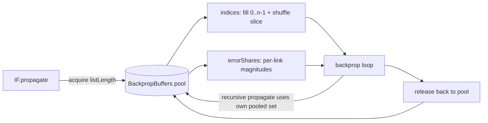

# perf: Reuse pooled buffers in IF.propagate instead of per-call typed-array allocation

## Summary

`IF.propagate` is the per-neuron backprop step for every IF neuron, every
sample, every epoch. It allocated two typed arrays on **every** call — `indices`
via the slow `Int32Array.from({ length }, cb)` form and `errorShares` via
`new Float64Array(listLength)` — both discarded at function exit. `IF.record`
additionally allocated an array per call via `inward.filter(...)`.

This change removes those per-call allocations by reusing the existing
stack-based buffer pool (`BackpropBuffers`) already used by the regular backprop
path. **Closes #3087.**

### Changes

- **`BackpropBuffers`** — added `indices: Int32Array` and
  `errorShares: Float64Array` to the pooled buffer set (allocated and grown
  alongside the existing eight buffers).
- **`IF.propagate`** — acquires a pooled buffer set, fills `indices` with a
  plain `for` loop, uses the pooled `errorShares`, and releases the set after
  all recursive `fromNeuron.propagate(...)` calls complete. The pool is
  stack-based, so each recursion level gets its own set.
- **`CreatureUtil.shuffle`** — gained an optional `length` parameter so the
  used `0..listLength-1` slice of the pooled `indices` buffer is shuffled
  without allocating a `subarray` view. Existing callers are unaffected
  (`length` defaults to `array.length`), and the Fisher-Yates iteration order
  over the slice is identical, preserving determinism.
- **`IF.record`** — replaced `inward.filter(...)` with an in-place index scan
  into a reused, stack-pooled scratch array (`eligibleScratchPool`). The array
  is consumed synchronously by `buildRecordElasticLinks` and returned to the
  pool before any recursive `record(...)` call, so a simple stack is safe.

### Correctness

`errorShares` from the pool is not zeroed, but ineligible entries are never
read: every consuming loop re-applies the same eligibility checks
(`from === to`, `condition`, sign-vs-`condition`) before using a share. Numeric
backprop results are therefore unchanged — confirmed by the full IF
propagation/record suite.

## Evidence

Backend/numerical change — no UI to screenshot. Performance is demonstrated by
a focused micro-benchmark plus the existing backprop suite.

**`deno bench --allow-read --allow-env bench/IfPropagateAllocation.ts`**
(Apple M4 Pro, Deno 2.8.3, 600 IF neurons, max in-degree 16):

| benchmark                                            | time/iter (avg) |   iter/s |
| ---------------------------------------------------- | --------------- | -------- |
| Fresh typed-array allocation per IF.propagate (600N) |        308.1 µs |    3,245 |
| Pooled buffers per IF.propagate (600N)               |         49.9 µs |   20,030 |

**Result: pooled path is 6.17× faster** than the fresh per-call allocation
pattern, removing two (sometimes three) per-call typed-array/array allocations
from the IF backprop path and cutting GC pressure proportional to
IF-neurons × samples × epochs.

## Test Plan

- `test/propagate/BackpropBuffers.ts` — added assertions that `acquire` returns
  `indices`/`errorShares` of sufficient capacity, that they are `Int32Array` /
  `Float64Array`, and that they grow with capacity.
- `test/architecture/CreatureUtils.ts` — added tests that
  `shuffle(array, length)` shuffles only the first `length` elements (leaving
  the tail untouched and producing a permutation), and that `length === 1`
  leaves the slice unchanged.
- Existing IF suites verify numeric backprop results are unchanged:
  `test/propagate/IF.ts`, `test/propagate/IFWeightedDistribution.ts`,
  `test/propagate/ifPropagation.ts`, `test/propagate/IfElse.ts`,
  `test/propagate/record/ElasticRecordIFPrefersPlasticPath.ts`.
- Full quality gate (`./quality.sh`) passes: 7400 passed, 0 failed.
