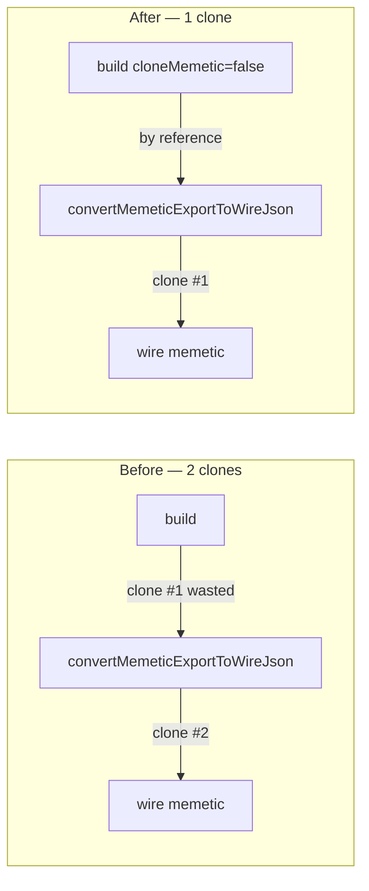

# perf: Eliminate double deep-clone of memetic in the creature export path

## Summary

Every external creature export deep-cloned `creature.memetic` **twice** and
threw the first clone away: once in `CreatureExportBuilder.build()` and again
inside `convertMemeticExportToWireJson()` (the wire converter). This ran
per-genome, per-generation on the worker→main dispatch and breeding paths, on
exactly the fittest / fine-tuned creatures that carry the largest memetic blobs.

The fix makes the wire converter the **single owner** that clones memetic
exactly once. `CreatureExportBuilder.build()` gains a `cloneMemetic` flag
(default `true`, so every existing caller is byte-for-byte unchanged). The two
wire-export call sites pass `cloneMemetic = false` because
`convertMemeticExportToWireJson()` already deep-clones its input — so the build
clone was pure waste:

- `exportJSON()` / `exportSnapshotJSON()` (wire path) → `build(false, false)`.
- `exportJSONWithRuntimeIds()` (worker→main / breeding path) →
  `build(true, false)`.

The wire converter never mutates its input, so attaching `creature.memetic` by
reference here never aliases the live creature into the export. The only
in-place consumer (`normaliseCreatureExport` via the `includeIds` branch) still
receives a private deep copy from `build()`, so no semantics change.

Net: **one** deep clone instead of two on every export, no semantic change.

Closes #3088.

## Data flow

## Evidence

Backend/library change — no UI to screenshot. Performance is demonstrated by a
new benchmark that exports a creature carrying a non-trivial memetic (weights /
biases / ancestry); none of the pre-existing export/worker benches populated
`creature.memetic`, so the clone cost was never measured.

`bench/export/ExportJsonMemetic.ts` (200 hidden neurons, depth-3 ancestry),
`deno bench`, Apple M4 / Deno 2.8.3:

| benchmark                                 | before (avg) | after (avg) | change      |
| ----------------------------------------- | ------------ | ----------- | ----------- |
| `exportJSON` (wire, with memetic)         | 747.5 µs     | 446.9 µs    | **−40.2 %** |
| `exportJSONWithRuntimeIds` (with memetic) | 741.4 µs     | 440.5 µs    | **−40.6 %** |

Baseline ("before") was captured by stashing only the three `src/` changes and
re-running the same benchmark; the wins scale with memetic size.

## Test Plan

- Added `test/creature/MemeticExportSingleClone.ts` ("what" tests, not timing):
  - `exportJSON`: wire memetic is correct (weights as
    `{ fromUUID, toUUID, weight }` array, biases keyed by wire UUID strings) and
    is **not aliased** to the live `creature.memetic` — mutating the export
    leaves the creature untouched.
  - `exportJSONWithRuntimeIds`: exported memetic is independent of the live
    creature.
  - `exportJSON` → `fromJSON` round-trip preserves memetic generation, score,
    biases, and weights.
- Full `./quality.sh` gate passes: **7403 passed, 0 failed, 4 ignored**.

## Files changed

- `src/utils/CreatureExportBuilder.ts` —
  `build(includeIds, cloneMemetic = true)`.
- `src/creature/CreatureSerialization.ts` — wire path skips the redundant clone.
- `src/architecture/PopulateRuntimeIdsFromCreature.ts` — runtime-id wire export
  skips the redundant clone.
- `bench/export/ExportJsonMemetic.ts` — new memetic-populated export benchmark.
- `test/creature/MemeticExportSingleClone.ts` — new regression tests.

Part of #3082 (performance-improvement sweep).
