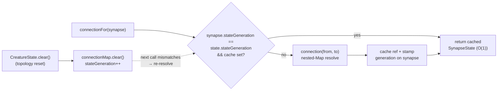

# perf: Cache SynapseState reference to avoid nested-Map double lookup

## Summary

`CreatureState.connection(from, to)` resolved a synapse's `SynapseState` through
a two-level `Map` — two hash lookups — and was called multiple times per synapse
per backprop step (e.g. `adjustedWeight` alone resolves it 2–3×). This made it
one of the highest-multiplicity operations on the pure-JS training path.

This change memoises the resolved `SynapseState` reference **on the `Synapse`
instance** and adds a `CreatureState.connectionFor(synapse)` accessor that
returns the cached reference after the first resolution, skipping both hash
lookups. A generation counter on `CreatureState` is bumped on every reset of the
connection map (`clear()`), so a stale cache is detected in `O(1)` — no walking
of the nested map is required.

`connectionFor()` is behaviourally identical to
`connection(synapse.from, synapse.to)`; only the cost of resolution differs, so
backprop numeric results are unchanged.

Closes #3089.

### Changes

- `src/architecture/Synapse.ts` — added runtime-only `stateCache?` and
  `stateGeneration?` fields (never serialised).
- `src/architecture/CreatureState.ts` — added `stateGeneration` counter,
  `connectionFor(synapse)`, and a generation bump in `clear()`.
- Hot call sites that already hold the `Synapse` now use `connectionFor`:
  `Weight.ts` (`adjustedWeight`), `NeuronPropagation.ts`, `MuonGradientHook.ts`,
  `WasmTopologicalBackprop.ts`, `CreatureActivation.ts`, and the aggregate
  methods `aggregate/{MINIMUM,MAXIMUM,IF}.ts`.

### How invalidation works

## Evidence

Backend/training-path change — no UI to screenshot. Evidence is the new
micro-benchmark and the test suite.

New micro-bench `bench/SynapseStateConnectionLookup.ts` isolates the per-step
state lookup that no existing bench covered (`NumericConnectionKeys` measures
the topology `connectionSet`, not this state lookup). It replays the realistic
per-synapse multiplicity (3 touches/synapse) over the full synapse set.

Run:
`deno bench --allow-read --allow-write --allow-env bench/SynapseStateConnectionLookup.ts`

| Scenario                      | `connection()` (double lookup) | `connectionFor()` (cached) | Speed-up         |
| ----------------------------- | ------------------------------ | -------------------------- | ---------------- |
| ~200 neurons, 8,084 synapses  | 435.3 µs                       | 222.8 µs                   | **1.95× faster** |
| ~500 neurons, 50,669 synapses | 3.0 ms                         | 1.4 ms                     | **2.09× faster** |

(Apple M4 Pro, Deno 2.8.3.) The cached path roughly halves the cost of the
isolated state lookup — a constant-factor cut on the innermost training loop
that scales with synapse count, samples, and epochs.

## Test Plan

New `test/architecture/CreatureStateConnectionFor.ts` (8 tests):

- `connectionFor` resolves the **same** `SynapseState` as `connection()`.
- Returns the cached reference on repeated calls (memoised on the synapse).
- Mutations via the cached state are visible through `connection()` (same
  object).
- Independent state per synapse pair.
- `clear()` invalidates the cache via the generation tag — a fresh
  `SynapseState` is returned.
- Re-resolves after `clear()` even when the synapse still holds the old
  reference.
- Distinct fresh state across multiple clears.
- Topology mutation → `clearState()` → re-activation yields fresh state (the
  invariant called out in the issue).

Existing `test/architecture/CreatureState.ts` and `CreatureStateFlatArray.ts`
continue to pass unchanged, confirming `connection()` behaviour is untouched.

**Documented test update:** `test/propagate/WeightConvergence.ts` mocks
`CreatureState`. Because `adjustedWeight` now resolves state via
`connectionFor(synapse)` instead of `connection(from, to)`, the two
batch-boundary mocks gained a `connectionFor` method returning the same
`SynapseState`. The behavioural assertions are unchanged — only the mocked
collaborator method was added to match the new accessor.
