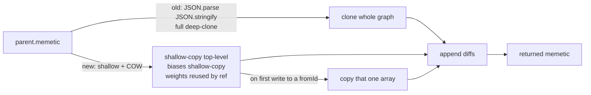

# perf: Avoid full JSON deep-clone in memeticUpdate (additive merge)

## Summary

`memeticUpdate` deep-cloned the parent's **entire** memetic graph via
`JSON.parse(JSON.stringify(parent.memetic))` and then appended only the handful
of changed bias/weight entries. The function runs per-offspring during breeding
(`Offspring.ts`) and per-mutation on the revert path (`Mutator.ts`) — i.e.
`O(children × generations)` — so for a populated memetic the full serialise/parse
round-trip dominated the additive merge it preceded.

This replaces the JSON round-trip with a **copy-on-write structural clone**:

- Shallow-copy the top-level object, carrying `generation`, `score` and the
  never-modified `ancestry` subtree **by reference** (not re-serialised).
- Shallow-copy `biases` with `{ ...parent.memetic.biases }` (values are
  primitives, so a shallow copy fully isolates it).
- Build `weights` as a new object that reuses each parent per-`fromId` array
  **by reference** until that key is first mutated; on first write the single
  array (and its entries) is copied. The result never aliases
  `parent.memetic`'s arrays for any key it mutates.

The merge output is value-identical to the old JSON-clone path for every
parent/child diff; only the cloning strategy changed.

Closes #3091. Part of the #3082 performance-improvement sweep.

## Evidence

This is a backend/library change with no web interface — no screenshot
applies. Verified via the new equivalence/isolation tests and a benchmark.

### Benchmark (`bench/MemeticUpdateCopyOnWrite.ts`)

Parent with a densely-populated memetic (biases for every neuron, multi-entry
weight arrays per source neuron, and 3 generations of ancestry snapshots) and a
child carrying a single changed bias. Baseline is the old JSON-clone-then-append;
candidate is the new copy-on-write `memeticUpdate`.

| Memetic size      | JSON deep-clone (baseline) | Copy-on-write (#3091) | Speed-up |
| ----------------- | -------------------------- | --------------------- | -------- |
| 50 hidden neurons | 263.2 µs                   | 40.3 µs               | 6.54x    |
| 200 hidden neurons| 1.1 ms                     | 162.2 µs              | 6.55x    |
| 800 hidden neurons| 4.3 ms                     | 737.4 µs              | 5.79x    |

The absolute saving grows with memetic size because the removed cost is the
full serialise/parse of the whole graph, while the copies are proportional to
the (small) number of changed entries.

## Test Plan

New `test/blackbox/MemeticUpdateCopyOnWrite.ts`:

- **Equivalence** — `memeticUpdate COW - equals JSON reference across a range of
  diffs`: the returned memetic deep-equals an independent JSON-clone-then-append
  reference for no-diff, bias-diff, weight-diff (existing key and key `5001`),
  and combined-diff cases.
- **Isolation** — `memeticUpdate COW - mutating result never mutates parent`:
  the mutated `fromId` array is a distinct object from the parent's; mutating
  the result's biases/weights/generation/score leaves `parent.memetic`
  unchanged.
- **COW reuse** — `memeticUpdate COW - unmutated weight arrays equal parent
  values`: untouched weight keys and the `ancestry` subtree carry the parent's
  values (shared by reference, as intended).

Existing `test/blackbox/MemeticUpdateDuplicateLoop.ts` (bias/weight detection,
undefined guards, existing-data preservation) continues to pass unchanged.

Full `./quality.sh` passes: `7416 passed | 0 failed`.
