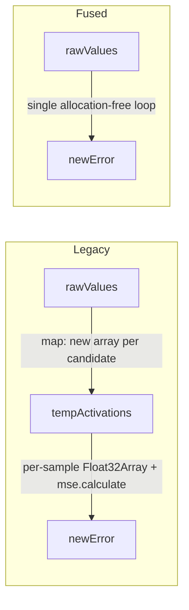

# perf: Fuse squash-candidate evaluation in discovery

## Summary

Discovery squash analysis evaluated ~39 candidate activation functions per focus
neuron, allocating a fresh intermediate array per candidate
(`rawValues.map(...)`) and routing every sample through a single-element
`Float32Array` + per-sample `mse.calculate` call (each dividing by `len = 1`).
This was repeatedly flagged as the aggressive allocator behind heap-critical
discovery aborts on large networks.

This PR fuses the evaluation into a single allocation-free loop per candidate:

- Added
  `calculateSquashErrorFromRaw(squashFunction, rawValues, idealActivations)`
  which squashes each raw value inline and accumulates the squared error in one
  pass — no per-candidate `tempActivations` array and no second iteration.
- Rewrote `calculateSquashError` to drop the per-sample `mse.calculate` /
  `Float32Array(1)` churn, using one fused loop instead. The unused `MSE` import
  was removed.
- `Math.fround` is applied to both operands in both functions, so results are
  bit-for-bit identical to the old `Float32Array`-rounded path — selected
  best-squash decisions are unchanged.
- The discovery candidate loop in `findCandidateSquash` now calls the fused
  helper.

This removes `O(39 × samples)` throwaway-array allocations and `O(39 × samples)`
function-call divides per focus neuron, directly cutting the heap pressure that
triggers discovery analysis aborts.

Closes #3092.

## Evidence

Backend/CLI change — no web interface to screenshot. Verified via unit tests
(numerical parity, identical best-candidate selection) and a benchmark.

### Benchmark (Apple M2 Ultra, Deno 2.8.3)

`bench/DiscoverSquashAnalysis_bench.ts` now contrasts the legacy candidate loop
(`map` + `calculateSquashError`) against the fused loop over all squash
candidates, at n = 100 / 1000 / 10000:

| n     | legacy (map + calculateSquashError) | fused (calculateSquashErrorFromRaw) | speed-up |
| ----- | ----------------------------------- | ----------------------------------- | -------- |
| 100   | 104.3 µs                            | 80.0 µs                             | 1.30×    |
| 1000  | 931.6 µs                            | 762.4 µs                            | 1.22×    |
| 10000 | 9.2 ms                              | 7.5 ms                              | 1.22×    |

Beyond the wall-clock gain, the fused form allocates **zero** per-candidate
arrays (was one `Float32Array`/`number[]` per candidate per focus neuron), which
is the heap-pressure reduction the issue targets.

### Data flow

## Test Plan

`test/ErrorGuidedStructuralEvolution/DiscoverSquashAnalysis.ts`:

- `calculateSquashErrorFromRaw - matches the mapped calculateSquashError` —
  asserts bit-for-bit parity with the legacy `map` + `calculateSquashError` path
  (`Math.fround` rounding match).
- `calculateSquashErrorFromRaw - zero when squash hits the ideals exactly` —
  edge case where error is exactly zero.
- `calculateSquashErrorFromRaw - picks the same best candidate as the legacy
  loop`
  — runs both scoring paths over the full candidate set and asserts the selected
  best squash is identical.
- All existing `calculateSquashError` tests retained and passing.

Full `./quality.sh` passes: 7416 passed, 0 failed.
