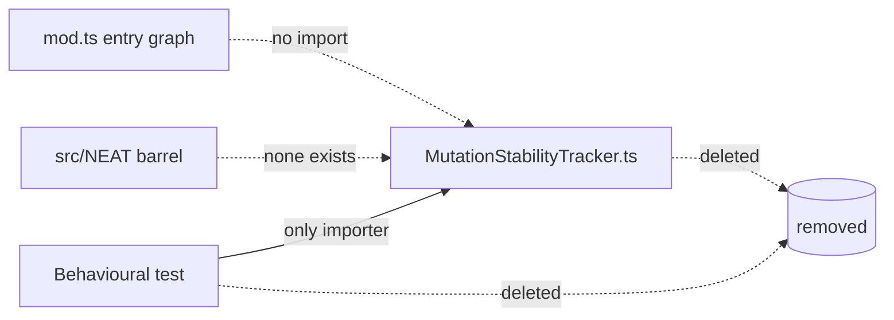

## Summary

Removed the dead-code module `src/NEAT/MutationStabilityTracker.ts` (384 lines)
and its orphaned behavioural test
`test/NEAT/MutationStabilityTrackerBehavioural.ts`. Closes #3106.

The module exported four public symbols — the `MutationStabilityTracker` class,
the `MutationOutcome` enum, and the `StabilityConfig` and `StabilityMetrics`
interfaces. It was added for Issue #1307 ("Reduce brittleness: adaptive mutation
rate based on validation stability") but was **never wired into the evolution
pipeline**:

- Not reachable from the `mod.ts` entry graph.
- Not re-exported from any barrel (there is no `src/NEAT/mod.ts`).
- No production `.ts` file under `src/`, `scripts/`, or `bench/` imports it.
- No dynamic / string-keyed reference to any of the four symbols exists.
- Its **only** importer was its own behavioural test, which kept otherwise dead
  code alive rather than guarding a real call site.

Issue #1307 is **closed** (5 Feb 2026), so the adaptive-mutation-rate work is
complete and this unintegrated module is genuinely dead, not pending
integration. The two remaining mentions of the symbol live in an archived
research snapshot (`docs/archive/research/deepseek-r1-applicability.md`) —
historical prose, not code — and were intentionally left untouched to preserve
that snapshot.

## Evidence

Backend/library change with no web interface to screenshot.

- `deno check mod.ts` → exit 0 (entry graph unaffected).
- `deno check test/**/*.ts` → exit 0 (no dangling imports left by removing the
  test).
- `./quality.sh < /dev/null` → exit 0: **7397 passed, 0 failed, 4 ignored**
  (lint, format, type-check, WASM sync, and full test suite).

## Test Plan

This is a pure dead-code deletion — no new behaviour to test. Verification is
that the codebase still compiles and the full suite still passes after removing
the module and its sole consumer:

- Removed `test/NEAT/MutationStabilityTrackerBehavioural.ts` (the only test that
  referenced the deleted module; it would otherwise fail to compile). This
  deliberate deletion is required by the module removal, per the test policy.
- Confirmed no other test or source file imports the removed symbols.
- Full `./quality.sh` run passes cleanly (7397 tests).
