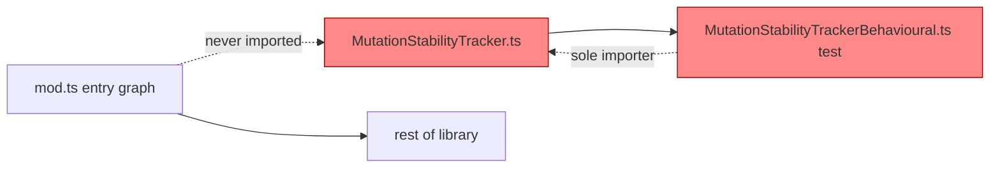

# PR Summary — Issue #3106

## Summary

Removed the dead-code module `src/NEAT/MutationStabilityTracker.ts` (and its
companion exports `MutationOutcome`, `StabilityConfig`, `StabilityMetrics`)
along with its now-orphaned behavioural test
`test/NEAT/MutationStabilityTrackerBehavioural.ts`.

The module was added for Issue #1307 ("Reduce brittleness: adaptive mutation
rate based on validation stability") but was never wired into the evolution
pipeline. Verification before removal:

- **Closed feature** — Issue #1307 is `CLOSED` / `COMPLETED`, so the work is not
  pending integration.
- **No production importers** — no `.ts` file under `src/`, `scripts/`, or
  `bench/` imports `@neat/MutationStabilityTracker.ts`.
- **Not part of the public API** — it is not re-exported from `mod.ts`.
- **Sole consumer was its own test** — `MutationStabilityTrackerBehavioural.ts`
  imported only `@std/assert` and the tracker module itself, so it was keeping
  otherwise-dead code alive rather than guarding a real call site.
- **No dynamic references** — a repo-wide search for `MutationStabilityTracker`,
  `MutationOutcome`, `StabilityConfig`, and `StabilityMetrics` found no
  string-keyed or reflective use outside the deleted module, its test, and stale
  build logs.

Closes #3106.

## Evidence

Backend/library change only — no web interface to screenshot. Verified by the
full quality gate (`./quality.sh`), which passed cleanly after removal:

```
ok | 7397 passed (2 steps) | 0 failed | 4 ignored (7m58s)
```



The cluster on the right (red) was self-contained and unreachable from the
package entry point — deleting both files leaves the rest of the library (`D`)
untouched.

## Test Plan

- Deleted the orphaned behavioural test
  `test/NEAT/MutationStabilityTrackerBehavioural.ts` (it imported only the
  removed module and would otherwise fail to compile). Per the no-comment-out
  rule, this test is removed, not disabled, because the production code it
  exercised no longer exists — documented here as the explicit justification.
- Ran `./quality.sh < /dev/null` (lint, type-check, full test suite):
  `7397 passed | 0 failed | 4 ignored`. No remaining references to the removed
  symbols in `src/`, `test/`, `scripts/`, `bench/`, or `mod.ts`.
