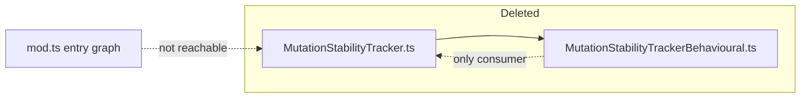

## Summary

Removed the dead `MutationStabilityTracker` module and its orphaned behavioural
test. The module was implemented for Issue #1307 ("Reduce brittleness: adaptive
mutation rate based on validation stability") but was never wired into the
evolution pipeline. Issue #1307 is **CLOSED / COMPLETED**, and verification
confirmed the code is genuinely dead rather than pending integration. Closes #3106.

Deleted:

- `src/NEAT/MutationStabilityTracker.ts` — the `MutationStabilityTracker` class,
  the `MutationOutcome` enum, and the `StabilityConfig` / `StabilityMetrics`
  interfaces.
- `test/NEAT/MutationStabilityTrackerBehavioural.ts` — the sole consumer; it
  imported only the deleted module and would fail to compile otherwise.

### Verification before deletion

- **Not in the public API** — `mod.ts` does not export or re-export the module
  (no `src/NEAT/mod.ts` barrel exists).
- **No production importer** — a repo-wide search (`*.ts`) found references to
  `MutationStabilityTracker`, `MutationOutcome`, `StabilityConfig`, and
  `StabilityMetrics` only inside the module itself and its behavioural test.
- **No dynamic/string reference** — searched `*.json`, `*.jsonc`, `*.md`,
  `*.sh`; the only hits were in an archived research snapshot
  (`docs/archive/research/deepseek-r1-applicability.md`), a point-in-time
  document left untouched (out of scope).
- **Feature genuinely abandoned, not pending** — Issue #1307 is closed as
  completed; no other adaptive-mutation tracker (`AdaptiveFineTuneTracker`,
  `SquashEffectivenessTracker`, `NeatEvolution`) imports or uses this module.

## Evidence

Backend/library change only — no web interface to screenshot.

- `./quality.sh` passes lint, format, and type-check; **7396 tests passed** with
  the module and its test removed.
- The one failure observed in the full run —
  `test/ErrorGuidedStructuralEvolution/DiscoveryTimeout.ts` → "Batch size 128
  saves more batches than 512 on timeout" — is a **pre-existing, load-dependent
  flake** unrelated to this change. It has zero references to the removed module,
  and the same untouched test alternates pass/fail across runs on both the base
  tree and this branch (confirmed: passed on base, then failed-then-passed on
  consecutive isolated runs of this branch). It asserts that a timeout fires
  partway through recording 5000 batches, which depends on machine load.

## Test Plan

- No new tests — this is a dead-code removal. Correctness is verified by the
  remaining suite continuing to compile and pass after the module and its sole
  test are deleted.
- Removed `test/NEAT/MutationStabilityTrackerBehavioural.ts` (orphaned; documented
  here as a deliberate deletion required by the module removal, per the TDD/test
  policy — it would not compile without the deleted module).
