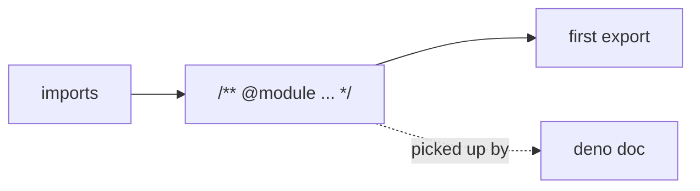

## Summary

Added a leading `@module` JSDoc block to nine public modules in
`src/architecture/` that previously went straight from their imports to their
first `export` with no module-level orientation for a new reader. Each block
gives a one-to-three-line plain-language summary of what the module provides and
how it fits the topology/breeding pipeline, following `docs/DOC_STYLE.md` and
matching well-documented siblings such as `CreatureFactory.ts`.

This is a documentation-only change — no code, types, or behaviour were
modified. Closes #3119.

Files documented:

- `src/architecture/CreatureState.ts`
- `src/architecture/CreatureValidate.ts`
- `src/architecture/DataSet.ts`
- `src/architecture/ElitismUtils.ts`
- `src/architecture/NeuronInterfaces.ts`
- `src/architecture/NoChangePropagate.ts`
- `src/architecture/Offspring.ts`
- `src/architecture/SynapseInterfaces.ts`
- `src/architecture/SyncV5.ts`

## Evidence

Backend/library change only — no web interface to screenshot.

`deno doc` confirms each new module doc is picked up. For example,
`deno doc src/architecture/Offspring.ts` now opens with:

```
@module
    Builds offspring creatures from two parents for the breeding pipeline —
    crossover of topology, synapses and hyperparameters. Neurons are aligned
    between parents by matching stable UUIDs (never array position), so the same
    genome breeds consistently across machines; child neurons keep their parent
    UUID and any newly created neurons get a fresh one.
```



Quality gate: `deno fmt`, `deno lint`, and `./quality.sh --check-only`
(type-check) all pass cleanly on the changed files.

## Test Plan

No unit tests apply — this is a pure documentation change adding JSDoc comments,
with no new or modified runtime behaviour to assert on (per AGENTS.md, tests
must verify behaviour, not inspect source text). Verification was done via:

- `deno fmt` / `deno lint` — clean on all 9 files.
- `./quality.sh --check-only` — type-check passes (exit 0).
- `deno doc src/architecture/Offspring.ts` — confirms the `@module` block is
  surfaced in generated documentation.
