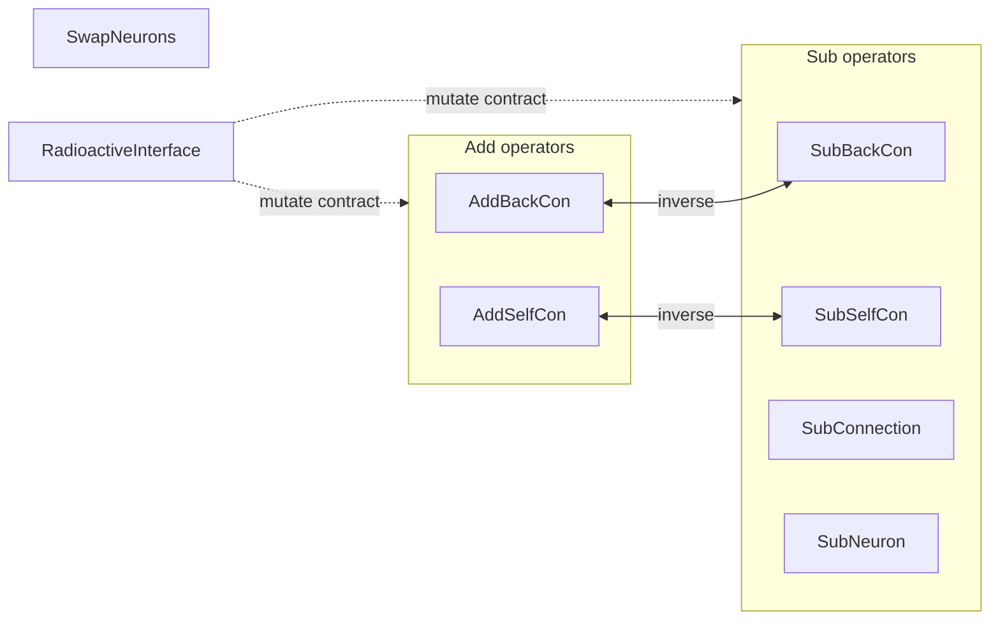

# PR Summary — Issue #3120

## Summary

Added leading `@module` JSDoc blocks to the eight public mutation-operator
modules in `src/mutate/` that previously opened straight onto their `export`
with no orienting doc comment. Each block gives a one-line description of what
the operator does — and, where relevant, its structural inverse — so a reader
scanning the mutation catalogue can tell at a glance what each operator does
without reading the body. Documentation only; no behaviour changes. Follows
[`docs/DOC_STYLE.md`](../../DOC_STYLE.md).

Closes #3120

Files documented:

- `src/mutate/AddBackCon.ts`
- `src/mutate/AddSelfCon.ts`
- `src/mutate/RadioactiveInterface.ts`
- `src/mutate/SubBackCon.ts`
- `src/mutate/SubConnection.ts`
- `src/mutate/SubNeuron.ts`
- `src/mutate/SubSelfCon.ts`
- `src/mutate/SwapNeurons.ts`

## Evidence

Documentation/CLI-only change — no web interface to screenshot. Verified each
module's `@module` block renders via the read-only `deno doc`, e.g.:

```text
$ deno doc src/mutate/SwapNeurons.ts
@module
    Mutation operator that swaps the bias and squash (activation) of two distinct
    hidden neurons, exploring parameter assignments without changing the
    connection structure.
```

All eight files render their `@module` summary. Doc text was fact-checked
against each operator's implementation (e.g. `SwapNeurons` swaps _both_ bias and
squash, not squash alone).



## Quality checks

- `deno fmt --check src/mutate/` — clean (14 files).
- `deno lint src/mutate/` — clean (14 files).
- `deno check src/mutate/*.ts` — clean.

(The full `./quality.sh` runs the complete test suite and exceeds the run
timeout; the targeted gates above cover this documentation-only change.)

## Test Plan

No code paths changed, so no behavioural tests were added. Verification is the
read-only `deno doc` render shown above, confirming every listed module now
exposes a module-level doc comment.
