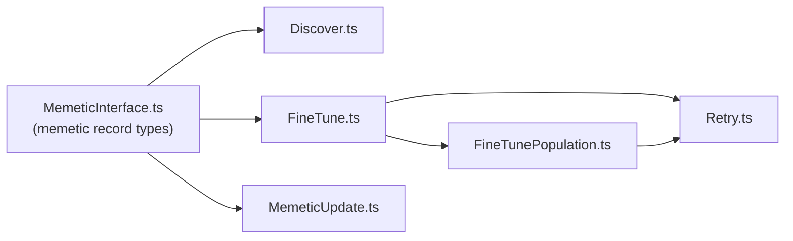

# Add `@module` docs to `src/blackbox` memetic modules (#3121)

## Summary

Six public modules in the `src/blackbox/` (memetic / fine-tune, aliased
`@blackbox/`) namespace exported a public symbol but had no leading module-level
doc comment, so a reader could not orient themselves to the fine-tune lifecycle
without tracing call sites. This PR adds a short leading `@module` JSDoc block
to each of the listed files, following
[`docs/DOC_STYLE.md`](../../DOC_STYLE.md). Documentation only — no code changes.

Files documented:

- `src/blackbox/Discover.ts` — reconstructs a child's memetic record from a
  matching scored parent.
- `src/blackbox/FineTune.ts` — quantum-step fine-tuning of the fittest creature.
- `src/blackbox/FineTunePopulation.ts` — builds the per-generation fine-tune
  population.
- `src/blackbox/MemeticInterface.ts` — type definitions for the memetic record.
- `src/blackbox/MemeticUpdate.ts` — propagates a parent's memetic record onto a
  child during breeding.
- `src/blackbox/Retry.ts` — re-runs fine-tuning when a creature's live score has
  drifted from its recorded memetic score.

Closes #3121.

## Evidence

This is a documentation-only change with no web interface to screenshot. Each
module doc was verified to be recognised as module-level documentation with the
read-only `deno doc` command, e.g.:

```text
$ deno doc src/blackbox/Discover.ts
Memetic-state discovery for the fine-tune (memetic evolution) path.

`discover` compares a scored parent with an as-yet-unscored child of
identical topology and, when their structure matches, reconstructs the
child's memetic record ...
```

All six files print their `@module` description, confirming the doc blocks are
attached at module level. `deno fmt --check`, `deno lint`, and `deno check` all
pass on the changed files.



## Test Plan

No automated tests were added: a test that greps source files for `@module`
would be a forbidden "how" test (per `AGENTS.md`), and the change adds no
behaviour to assert on. Validation is via `deno doc` (above) plus the standard
quality gate (`deno fmt`, `deno lint`, `deno check`), all of which pass.
