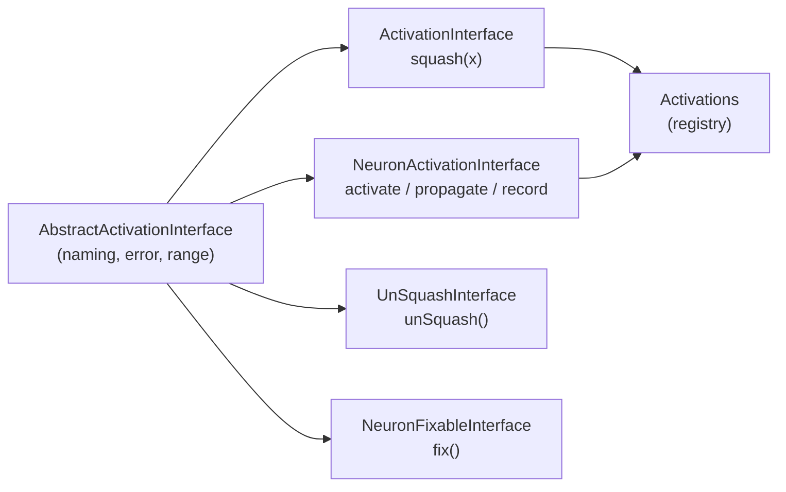

# DOC-MODULE-DOC: `@module` docs for `src/methods/activations` interfaces

## Summary

The public interface and registry modules in `src/methods/activations/` opened
straight onto imports then an exported symbol, with no leading module-level doc
comment explaining what contract each one defines. Because these are the
extension points a consumer implements to add an activation, the missing
`@module` block cost integrators discoverability.

Added a short leading `@module` JSDoc block to each of the five affected files,
following [`docs/DOC_STYLE.md`](../../DOC_STYLE.md) and matching the existing
style in `TypeGuards.ts`:

- `src/methods/activations/ActivationInterface.ts` — scalar `squash(x)`
  contract.
- `src/methods/activations/Activations.ts` — central activation registry.
- `src/methods/activations/NeuronActivationInterface.ts` — whole-`Neuron`
  activation/propagation/record contract.
- `src/methods/activations/NeuronFixableInterface.ts` — optional post-mutation
  `fix()` contract.
- `src/methods/activations/UnSquashInterface.ts` — optional inverse-of-`squash`
  contract.

Documentation only — no code or behaviour change. Australian English throughout.

Closes #3123.

## Evidence

This is a documentation-only change with no web interface to screenshot.
Verification was done with the read-only `deno doc` command, which now surfaces
the `@module` summary for every file. Example:

```
$ deno doc src/methods/activations/ActivationInterface.ts
@module
    Contract every standard activation function implements: the `squash(x)`
    forward pass mapping a neuron's pre-activation value to its output. ...
```

All five files render their `@module` block; previously `deno doc` showed only
the exported symbol with no module summary.



## Test Plan

No tests added or modified. Per `AGENTS.md`, asserting on documentation content
would be a "how" test (grepping source for patterns), which the project
prohibits. Verification instead relied on:

- `deno doc <file>` for each of the five files — confirms the `@module` summary
  renders.
- `./quality.sh --lint-only` — formatting, lint, and bash checks pass.
- `./quality.sh --check-only` — `deno check` type-checks the full tree cleanly.
