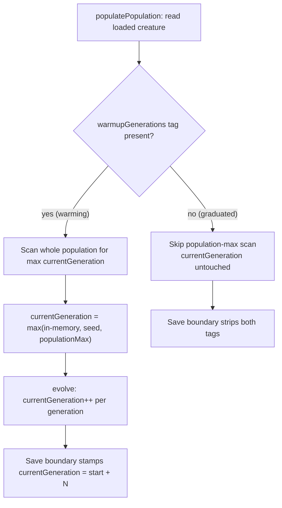

# currentGeneration must always increase across machines (Issue #3138)

## Summary

`currentGeneration` is the lineage counter that gates the seed warm-up
structural lock (#2828). Across a teams run it was not climbing reliably, so
warm-up never completed across machines. The converged design — accumulate
(start + generations run), reconcile across machines by taking the **maximum**
at the population seed, gate on the **loaded** creature, and strip both tags
once warm — was largely already in place from #2908 / #2945 / #2909 / #2911.

The one remaining gap: `Neat.populatePopulation` seeded the counter
**unconditionally**. When the loaded champion had graduated (no
`warmupGenerations` tag), a still-warming immigrant in `config.creatures` could
still seed `currentGeneration` from its tag — violating the "**gate on the
loaded creature only**" rule.

The fix gates the population-max scan and counter seeding on the **loaded**
creature's `warmupGenerations` tag: once the loaded champion has graduated,
warm-up is off for the whole call and no immigrant can seed the counter. The
save boundary (`applySeedWarmupTagsAtSave`) already strips both tags in that
case, so the output emerges warm-up-free.

The cross-machine "take the maximum" and "start + N" accumulation paths were
verified by new regression tests and already passed — confirming those parts
were correct; only the graduated-gate test was red before this change.

Closes #3138.

## Evidence

Backend/engine change — no UI to screenshot. Verified by unit tests
(`deno test`) and the full `./quality.sh` gate (**7401 passed, 0 failed**).

The three concrete issue cases, exercised as "what" tests against
`populatePopulation`:

| Case | Setup | Expected | Result |
| --- | --- | --- | --- |
| Accumulate | loaded tag 10, run 50 generations | `currentGeneration == 60` | pass (already worked) |
| Cross-machine max | machine A tag 10, machine B tag 20 | seed `currentGeneration == 20` | pass (already worked) |
| Graduated gate | graduated seed + immigrant tag 500 | `currentGeneration == 0` | **red before fix → green after** |

## Test Plan

Added to `test/NEAT/NeatPopulatePopulation.ts`:

- `populatePopulation: start 10 + 50 generations accumulates to 60 (Issue #3138)`
  — start generation seeded from the tag, then 50 increments → 60.
- `populatePopulation: machine A (10) and machine B (20) take the maximum 20 (Issue #3138)`
  — two prior champions in `config.creatures`; the seed takes `max(10, 20)`.
- `populatePopulation: graduated seed ignores a warming immigrant's generation (Issue #3138)`
  — graduated loaded seed; a warming immigrant (tag 500) must **not** seed the
  counter (stays 0). This test was failing before the gate and passes after.

Existing warm-up tests (`SeedWarmupPersistence.ts`, the rest of
`NeatPopulatePopulation.ts`) remain green, confirming no regression to the
#2908 / #2945 / #2909 / #2911 behaviour.
