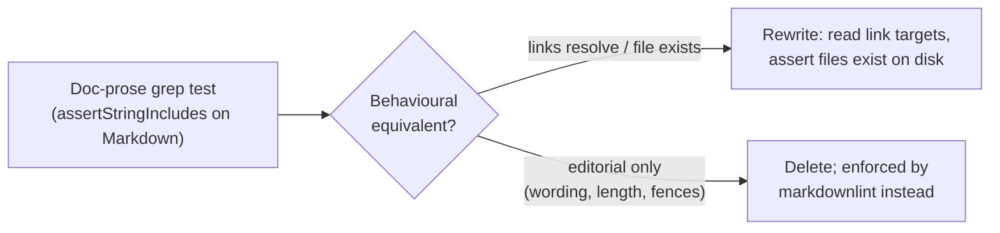

# Remove doc-prose content-grep test assertions

## Summary

A cluster of tests read committed Markdown documentation and asserted on
its **prose text** — headings, acronym expansions, sentence fragments,
link-text substrings, `content.length` / line-count thresholds and
` ```mermaid ` fences — via `assertStringIncludes` / `.includes()` /
regex `.test()`. These are "how" tests, not "what" tests: they assert that
a doc happens to contain a particular string today, so they break the
moment a heading is reworded, an acronym table is reformatted, a doc is
split, or a paragraph is trimmed below a length threshold, even though
nothing a reader or caller can observe has changed. They actively obstruct
documentation refactoring.

This change applies the two resolutions the issue blesses — rewrite to
observable behaviour, or delete the prose assertion — to each call site.
Heading wording, acronym tables and Mermaid fences remain editorial
conventions enforced by the Markdown linter (`.markdownlint-cli2.jsonc`),
not by substring tests in the unit-test runner.

Closes #3142.

### What changed per call site

| File | Action |
| --- | --- |
| `test/docs/DocsIndex.ts` | Kept only the behavioural **link-resolution** test (reads link targets, asserts the referenced files exist). Removed the `content.length > 500`, topic-heading, acronym-expansion, "where to start", `pr-summary-`/`archive`, "Docs map", Mermaid-fence and substring-coverage greps, plus the now-unused constants/imports. |
| `test/docs/GlossaryAndStyle.ts` | Kept the two behavioural **link-resolution** tests (`GLOSSARY.md`, `DOC_STYLE.md`). Removed the length, acronym, themed-term, house-style-keyword, NEAT-rule-link and Mermaid-fence greps. |
| `test/docs/ComparisonSplit.ts` | Kept the two behavioural **link-resolution** tests; detail-doc existence is now asserted by reading each doc inside the link-resolution test (a missing file makes `readTextFile` throw). Removed the `<= 320` line-count cap, link-substring coverage, comparison-table regex, Mermaid-fence, `content.length > 500` and `NEAT-AI ≠ NEAT` callout greps. |
| `test/scripts/BuildScript.ts` | Removed the `CORE_DEPENDENCY_POLICY documents the new artifact-based flow` prose grep (left a documenting comment, mirroring the #2886 note). The `--verify-only` / `--rev` contracts are already proven behaviourally by the surrounding tests that run `build.sh` and assert on exit codes / stdout / stderr. |
| `test/scripts/ContributorCoreDocs.ts` | **Deleted** — every test was a `CONTRIBUTING.md` / `README.md` wording substring grep with no behavioural residue. |
| `test/scripts/ParityAuditsConsolidation.ts` | **Deleted** — every test grepped doc prose for issue numbers, subject names, link fragments and Mermaid fences. |

Out-of-scope structured checks (e.g. `CoreDependencyPolicy.ts` comparing
`neatCore.ref` against `deno.json`, and the YAML-parsing `test/ci/*`
workflow guards) were left untouched — they assert on resolved
configuration, not prose.

## Evidence

This is a test-suite/CLI change with no web interface to screenshot. The
retained behavioural tests pass:

```
running 1 test from ./test/docs/DocsIndex.ts
docs/README.md internal links resolve ... ok
running 2 tests from ./test/docs/GlossaryAndStyle.ts
docs/GLOSSARY.md internal links resolve ... ok
docs/DOC_STYLE.md internal links resolve ... ok
running 2 tests from ./test/docs/ComparisonSplit.ts
COMPARISON.md relative links resolve ... ok
Comparison detail docs exist and their relative links resolve ... ok
running 7 tests from ./test/scripts/BuildScript.ts
build.sh --help prints usage and lists new flags ... ok
build.sh -h prints usage and exits 0 ... ok
build.sh rejects unknown flags ... ok
build.sh --rev rejects non-hex / wrong-length values ... ok
build.sh --rev requires a value ... ok
build.sh --verify-only is a no-op when vendored bundle matches pin ... ok
build.sh --verify-only does not resolve HEAD over the network ... ok

ok | 12 passed | 0 failed
```

`deno fmt`, `deno lint`, and `deno check` pass on the changed files. The
full `./quality.sh` run was green except for
`test/ErrorGuidedStructuralEvolution/DiscoveryTimeout.ts` — a
timing-dependent timeout test unrelated to this change that passes in
isolation (`4 passed | 0 failed`); the failure is flakiness under the
parallel full-suite run, not a regression from these edits.



## Test Plan

- Behavioural link-resolution tests retained and passing in
  `test/docs/DocsIndex.ts`, `test/docs/GlossaryAndStyle.ts`,
  `test/docs/ComparisonSplit.ts`.
- `build.sh` flag-parsing behavioural tests in `test/scripts/BuildScript.ts`
  retained and passing.
- Prose-grep tests removed (documented above); two fully-prose test files
  deleted.
- `deno fmt` / `deno lint` / `deno check` clean on all changed files.
