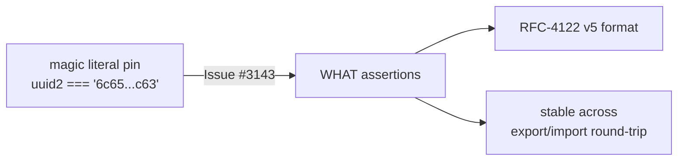

# PR Summary — Issue #3143

## Summary

`test/creature/CreatureUUID.ts` pinned the output of
`CreatureUtil.makeUUID(clean)` to the hard-coded literal
`6c65e71e-a5c6-5e46-8abb-06f991c79c63`, with a comment admitting the value was
implementation-derived and had to be hand-edited _"when export identity /
makeUUID canonicalisation changes"_. That is a magic-value "how" test: it
asserts the answer the current code happens to produce rather than the answer
the spec requires, so any legitimate change to the UUID derivation forces a
manual rewrite of the constant instead of surfacing a real regression.

This change applies resolution (a) from the issue — rewrite the assertion to the
durable **WHAT** properties:

1. `makeUUID` returns a well-formed **RFC-4122 v5** UUID (version nibble `5`,
   RFC-4122 variant nibble `8`/`9`/`a`/`b`).
2. That UUID is **stable across reconstruction** of the same canonical structure
   — `makeUUID(fromJSON(export))` round-trips. `exportJSON()` omits the
   top-level `uuid`, so the round-trip genuinely re-derives the value from the
   wire structure rather than echoing a carried field.

These are properties any refactor of the canonicalisation must preserve, so the
test now catches real regressions without obstructing future changes. The
relational determinism/order-independence checks already present in the file
(`assertEquals(uuid2, uuid1)`, `assertEquals(uuid3, uuid1)`, `assertNotEquals`
and the `ignoreOrderUUID` test) are untouched.

Closes #3143.

## Evidence

Backend/test-only change — no UI to screenshot. Verified via the test runner.

Targeted run (`deno test test/creature/CreatureUUID.ts`):

```
running 5 tests from ./test/creature/CreatureUUID.ts
knownName ... ok
ignoreTags ... ok
keepUUID ... ok
generateUUID ... ok
ignoreOrderUUID ... ok
ok | 5 passed | 0 failed
```

Full quality gate (`./quality.sh`):
`ok | 7365 passed (2 steps) | 0 failed | 4 ignored`.



## Test Plan

- Modified `test/creature/CreatureUUID.ts::ignoreTags`: replaced the hard-coded
  UUID `assert` with an RFC-4122 v5 format assertion plus an export/import
  round-trip stability `assertEquals`.
- No existing tests removed or commented out; the surrounding relational
  assertions remain in place.
