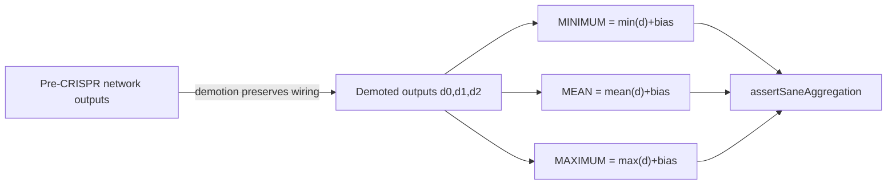

# PR Summary — Issue #3144

## Summary

The two CRISPR DNA-SANE rewrite tests in `test/CRISPR/CRISPR.ts`
(`CRISPR-multi-outputs1` and `CRISPR-multi-outputs2`) ended with six
full-precision activation floats pasted verbatim from a run, e.g.
`assertAlmostEquals(out[0], 0.024987129494547844, 1e-5)`. These are the
hard-coded-magic-value anti-pattern: they assert whatever the activation engine
_happens to emit_ rather than the behaviour the spec requires, so a
behaviour-preserving backend switch (WASM, future GPU) or a forward-pass reorder
forces a regenerate-the-constants edit even when the documented MIN/MEAN/MAX
contract is unchanged — masking real regressions.

This change rewrites the six float assertions to track the spec relationship
(resolution **(a)** from the issue). DNA-SANE appends three outputs — `MINIMUM`,
`MEAN`, `MAXIMUM` — each wired to the three previous outputs, which CRISPR
demotes to hidden. Demotion preserves a neuron's wiring, bias and squash, so the
demoted outputs compute exactly what the **pre-CRISPR** network's outputs
compute for the same input. A fresh copy of the original network therefore gives
a spec-derived oracle (`demoted`), and the new `assertSaneAggregation` helper
asserts:

- `out[0] == Math.min(...demoted) + biasₘᵢₙ`
- `out[1] == mean(demoted) + biasₘₑₐₙ`
- `out[2] == Math.max(...demoted) + biasₘₐₓ`

Because the oracle is derived from the values the network actually computes, the
assertion tracks the MIN/MEAN/MAX behaviour and tolerates last-digit float
drift, while still catching a genuine aggregation regression. The strong
structural assertions already in each test (output count, output squashes,
synapse counts, tag counts) are untouched.

Closes #3144.

## Evidence

Backend/test-only change — no UI. Verified by running the affected test file:

```
deno test --allow-all test/CRISPR/CRISPR.ts
...
CRISPR-multi-outputs1 ... ok
CRISPR-multi-outputs2 ... ok
ok | 7 passed | 0 failed
```

Confirmed the spec relationship matches the previously-frozen floats within the
assertion tolerance (max observed delta ≈ 1.7e-8, well under `1e-6`):

| output | frozen float (old)   | spec oracle (min/mean/max + bias) |
| ------ | -------------------- | --------------------------------- |
| out[0] | 0.024987129494547844 | 0.024987129324674607              |
| out[1] | 0.3913297653198242   | 0.3913297690451145                |
| out[2] | 0.5962033867835999   | 0.5962033701896667                |

Repo-wide `deno lint` (1740 files) and `deno check` both pass.



## Test Plan

- Rewrote `test/CRISPR/CRISPR.ts::CRISPR-multi-outputs1` and
  `CRISPR-multi-outputs2` to assert the MIN/MEAN/MAX aggregation contract via
  the new `assertSaneAggregation` helper instead of six frozen floats.
- `deno test --allow-all test/CRISPR/CRISPR.ts` — 7 passed, 0 failed.
- `deno fmt`, `deno lint`, `deno check` clean on the changed file; repo-wide
  lint and type-check pass.
