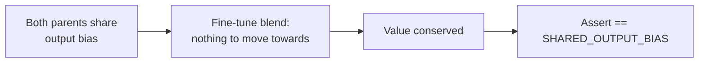

# Remove magic post-fine-tune bias value in FineTuneUUID test

## Summary

`test/blackbox/FineTuneUUID.ts` asserted the post-fine-tune output-neuron bias
against a pasted full-precision literal (`-0.49135010426905`) with no
derivation — the hard-coded-magic-value anti-pattern (check 5). A refactor of
the fine-tune blend that preserved its observable contract but computed
intermediate values differently would break the assertion even though behaviour
was unchanged.

Crucially, that literal is **already the output bias of both parents** in the
test fixtures (the `previousFittest` and `fittest` creatures share it). Because
the fine-tune step blends the current fittest *towards* the previous fittest,
when both parents agree on a value the blend has nothing to move towards and
must conserve it. The assertion is therefore a **preservation** property, not an
opaque intermediate.

This PR makes that explicit and removes the magic value:

- Introduced a single source-of-truth constant `SHARED_OUTPUT_BIAS`, documented
  with the preservation rationale.
- Both parent fixtures and the line-180 assertion now reference that constant
  instead of repeating the literal — so the assertion is **derived**, not pasted.

The assertion now verifies the WHAT (a value both parents agree on is preserved
by fine-tuning) and survives any behaviour-preserving refactor of the blend.
This follows resolution (a) from the issue.

Closes #3145.

## Evidence

Backend/test-only change — no web interface to screenshot.



Test run after the change:

```
running 1 test from ./test/blackbox/FineTuneUUID.ts
tune ... ok (50ms)
ok | 1 passed | 0 failed
```

`deno fmt`, `deno lint`, and project-wide `deno check` (`./quality.sh
--check-only`) all pass.

## Test Plan

- Modified `test/blackbox/FineTuneUUID.ts::tune`:
  - Replaced the pasted bias literal at the line-180 assertion with the derived
    `SHARED_OUTPUT_BIAS` constant, documenting the preservation contract.
  - Both parent output-neuron fixtures now reference the same constant, giving a
    single source of truth.
- No business logic changed; no existing test removed or commented out. The test
  still verifies the same observable behaviour (bias preserved, input weights
  preserved, `0.32` bias changed, ten creatures produced).
