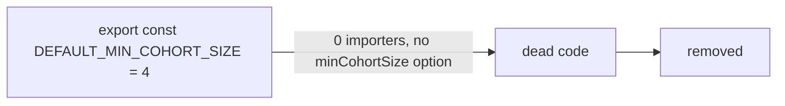

# Remove unused export `DEFAULT_MIN_COHORT_SIZE`

## Summary

Removed the dead exported constant `DEFAULT_MIN_COHORT_SIZE = 4` from
`src/NEAT/GroupRelativeAdvantage.ts`. A whole-repository word-boundary search
confirmed the symbol had exactly one occurrence — its own declaration. It was
never imported, never re-exported from `mod.ts`, and the `AdvantageOptions`
interface has no `minCohortSize?` field for it to back, so the default had
nothing to default. Its siblings `DEFAULT_ADVANTAGE_EPS` and
`DEFAULT_ADVANTAGE_CLIP` remain (they are consumed by `eps?` / `clip?`).

Closes #3148.

## Evidence

Backend/library change only — no web interface to screenshot.

Verification performed:

- `git grep -n "DEFAULT_MIN_COHORT_SIZE"` before the change returned a single
  hit (the declaration); after removal it returns none.
- `./quality.sh` passes cleanly (`EXIT=0`, `7366 passed | 0 failed`), confirming
  the type-checker found no dangling reference to the removed symbol.

## Test Plan

- Added `test/NEAT/GroupRelativeAdvantage.ts` regression test
  "GRPO advantage: DEFAULT_MIN_COHORT_SIZE is not part of the module surface
  (Issue #3148)" — imports the module namespace and asserts the key is absent.
- Existing `test/NEAT/GroupRelativeAdvantage.ts` suite (15 tests) continues to
  pass, confirming the surviving exports and behaviour are unchanged.
