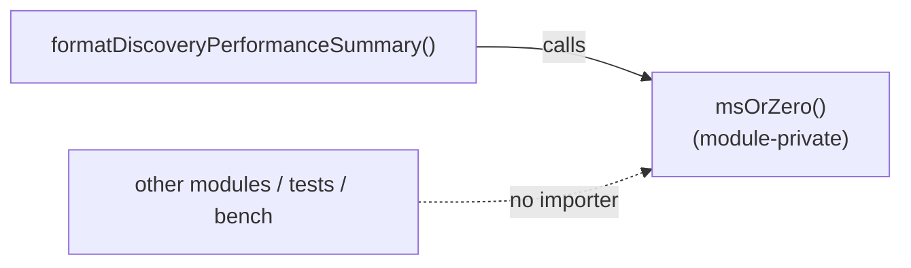

## Summary

Removed the unused `export` from the `msOrZero` helper in
`src/architecture/ErrorGuidedStructuralEvolution/DiscoveryPerformance.ts`. A
whole-repository word-boundary search confirmed `msOrZero` is referenced only
inside its own module (its definition plus one internal call from
`formatDiscoveryPerformanceSummary`) — no other `src/` module, test, or bench
imports it, and it is not re-exported from any barrel. The `export` keyword
therefore exposed a symbol nothing outside the file consumed.

The safe change is to drop only the `export` keyword, keeping the function as a
module-private helper. The function body is unchanged, so behaviour is
identical. Closes #3149.

## Evidence

Backend/library change with no web interface to screenshot. Verified via the
quality gate and the targeted test file:

- `deno test test/discovery/DiscoveryPerformanceSummary.ts` → `2 passed`.
- `./quality.sh` → `7367 passed | 0 failed | 4 ignored` (lint, format,
  type-check, WASM sync, full test suite).
- Confirmed no remaining importer: `grep -rn '\bmsOrZero\b' src test bench mod.ts`
  matches only the definition and the single internal call, both inside
  `DiscoveryPerformance.ts`.

## Test Plan

- Added `test/discovery/DiscoveryPerformanceSummary.ts` →
  "Discovery performance summary clamps non-finite total times to zero
  (Issue #3149)": feeds non-finite `recordPhaseTime` / `analysisPhaseTime` /
  `totalTime` through the public `formatDiscoveryPerformanceSummary` and asserts
  no `Infinity`/`NaN` leaks into the rendered output and each total renders as
  the zero-duration form. This locks in the clamping behaviour `msOrZero`
  provides now that the helper is module-private.
- Existing "omits unrecorded (zero) phase timings" test continues to pass.
