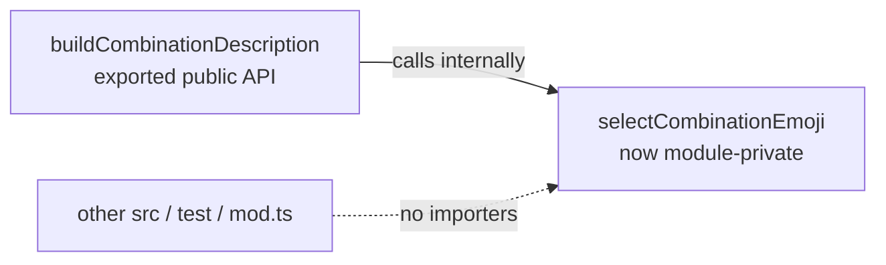

# PR Summary — Issue #3150

## Summary

`selectCombinationEmoji` in `src/discovery/CandidateDescriptions.ts` was
declared `export` but had no importer anywhere in the repository — a
whole-repo word-boundary search finds references only inside its own module,
where `buildCombinationDescription` calls it once. It is not re-exported from
`mod.ts` or any barrel, and no test imports it.

This change drops the unused `export` keyword, keeping the function as a
module-private helper. Behaviour is unchanged — the symbol is still live
internally. Closes #3150.

**Deno regression avoided:** verified and added coverage with native Deno
tooling (`deno test`, `deno lint`, `deno check`) — no Node tooling introduced.

## Evidence

Backend-only change with no web interface to screenshot. Verified via tests
and the project quality gate.

- New test exercises the emoji-selection logic through the public
  `buildCombinationDescription` API (the only consumer of the now-private
  helper), so coverage survives the de-export and any future refactor.
- `deno lint` and `deno check` are clean on both changed files.
- The two failures observed during the full `quality.sh` run
  (`VersionStartupLog.ts` and `DiscoveryTimeout.ts`) are pre-existing flakes
  unrelated to this change — both pass cleanly when run in isolation (`9
  passed | 0 failed`). They are timing/heap-pressure sensitive under the full
  parallel suite and do not touch `discovery/CandidateDescriptions`.

## Test Plan

Added `test/discovery/CandidateDescriptions.ts` (10 tests, all passing):

- `shortID` happy path + short-id edge case.
- `buildCombinationDescription` covering each emoji branch: 🏆 (3+ types),
  🦋 (removal+addition), ⚡ (squash+removal), ✂️ (pure neuron removal),
  🌱 (neurons+synapses), 🧬 (single add-neurons), single remove-synapse.
- `describeSingleCoordinatedStructuralOperation` for `addNeuron`.
