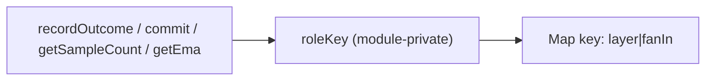

## Summary

Removed the redundant `export` keyword from the `roleKey` helper in
`src/NEAT/SquashEffectivenessTracker.ts`, making it a module-private function.
The symbol is used several times internally (Map-key encoding for per-role
squash statistics) but has no importer anywhere in the repository — no other
`src/` module, test, or bench references it, and it is not re-exported from any
barrel. Dropping the `export` keeps the function and all behaviour identical
while removing dead public surface. Closes #3151.

## Evidence

Backend/library change only — no web interface to screenshot.

Verification that `roleKey` has no external consumer:

```
$ grep -rn "roleKey" --include="*.ts" . | grep -v SquashEffectivenessTracker.ts
(no output)
```

Internal uses remain (lines 158, 248, 256, 273), so the function stays and is
still exercised through the tracker's public methods.



## Test Plan

- No public API changed: `roleKey` was never imported by any test, so the
  existing suite already serves as the regression guard. The tracker's public
  methods that call `roleKey` internally are covered by
  `test/NEAT/SquashEffectivenessTracker.ts` (`recordOutcome`, `recordPending`,
  `commit`, `getSampleCount`, `getEma`, `computeRole`).
- Ran `deno test --allow-all test/NEAT/SquashEffectivenessTracker.ts`: 14
  passed, 0 failed.
- Ran `./quality.sh` to confirm lint, type-check, and tests pass cleanly.
