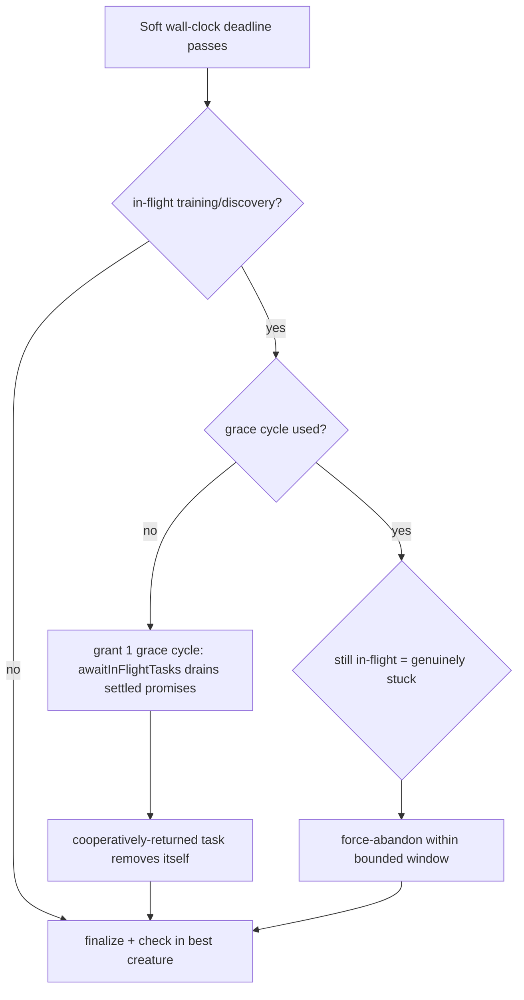

## Summary

`evolve()` / training tasks did not return when their own stop/timeout elapsed —
they were force-abandoned by the outer wall-clock deadline instead. In the
GRQ-16 forex run, task `362f688b` logged `timed out after 16m 26s` **and** still
appeared in the `Abandoning stuck training task(s)` list. Separately, budgets
clamped by an imminent hard deadline produced sub-50 ms "timeouts" (16–93 ms)
that trained nothing.

Root cause and fix:

1. **Forced abandon of cooperatively-returning tasks.** A worker that hit its
   per-task timeout has already returned; its result callback (which removes the
   task from `trainingInProgress` / `discoveryInProgress`) runs as a microtask
   on the _next_ finish-up cycle. But `Neat.finishUp()` force-cleared every
   in-flight task the instant the soft wall-clock deadline passed — before that
   callback could run — mislabelling the just-returned task "stuck". Now
   `finishUp()` grants **one bounded grace cycle** after the wall-clock deadline
   passes, during which `awaitInFlightTasks()` drains the settled promises, so
   the task removes itself instead of being force-abandoned. Genuinely stuck
   tasks (promise never settles) are still abandoned — by the per-task watchdog
   and, as a backstop, on the next cycle — so the run always finalizes within a
   bounded window.

2. **Sub-second budgets.** `scheduleTraining()` now computes each task's
   effective budget (`min(relative budget, hardDeadlineTS) − now`) up front and
   **skips + flags** any budget below `MIN_TRAINING_BUDGET_MS` (1 s) with a
   clear misconfiguration warning, rather than dispatching a worker that could
   only time out in milliseconds.

New pure, `now`-injectable helpers `computeEffectiveTrainingBudgetMs` and
`isTrainingBudgetTooSmall` live in `src/NEAT/PerTaskTrainingTimeout.ts` (policy
from Issue #2888).

Closes #3166

## Evidence

Backend/CLI change — no web interface to screenshot. Verified by unit tests (all
pure/behavioural, no elapsed-time assertions) and repo-wide `deno fmt --check`,
`deno lint`, and `quality.sh --check-only`.



Test output (new + existing, all green):

```
test/NEAT/PerTaskTrainingTimeout.ts  — budget helpers + per-task cap
test/NEAT/NeatFinishUp.ts            — grace cycle vs. stuck-task force-abandon
test/NEAT/NeatStuckTaskWatchdog.ts   — per-task watchdog unchanged
ok | 30 passed | 0 failed
```

## Test Plan

- `test/NEAT/PerTaskTrainingTimeout.ts`
  - `computeEffectiveTrainingBudgetMs` — remaining budget, negative when the
    deadline has passed, and `+Infinity` when no timeout is configured.
  - `isTrainingBudgetTooSmall` — flags the GRQ-16 millisecond budgets (16, 93
    ms), zero/negative budgets, and the floor boundary; accepts
    plausible/unbounded budgets; honours a custom minimum.
- `test/NEAT/NeatFinishUp.ts`
  - `grants a grace cycle so a cooperatively-returning training task is not
    force-abandoned`
    — the task survives the first post-deadline cycle, then the run finalizes
    cleanly once it removes itself. (Fails against the pre-fix code, which
    force-abandoned it immediately.)
  - `still force-abandons a genuinely stuck training task within a bounded window`
    — a never-settling task is still cleared within a bounded number of cycles.
  - Existing wall-clock / never-settling finish-up tests remain green.

## Security Self-Check

Backend-only change to internal timeout bookkeeping. No new external input, I/O,
SQL, shell, or auth surface; no secrets touched. Inputs are numeric timestamps
validated by the pure helpers (non-positive → no-timeout sentinel).
