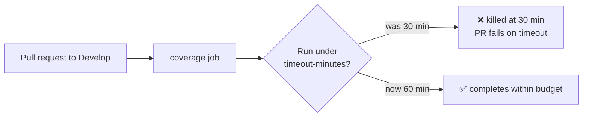

## Summary

Extended the CI **Test Coverage** job timeout from 30 minutes to 60 minutes. The
coverage run is the heaviest workflow (full test suite plus coverage collection)
and has occasionally exceeded 30 minutes, causing PRs to fail on a timeout
rather than a genuine test failure. Raising the cap to an hour gives the run
enough head-room while still staying well under the 6-hour GitHub default that
the existing resource-hygiene gate guards against. Closes #3168.

Change: `.github/workflows/coverage.yaml` — `timeout-minutes: 30` → `60`.



## Evidence

Backend/CI-only change — no web interface to screenshot. Verified via the
workflow-configuration unit tests, which parse the committed YAML and assert on
the resulting configuration (a "what" test, not a source grep).

Test run
(`deno test -A --config ./deno.json test/ci/WorkflowJobTimeoutMinutes.ts`):

```
at least one workflow file is present to validate ... ok
every workflow job declares an explicit timeout-minutes ... ok
coverage workflow allows at least an hour for its job ... ok
ok | 3 passed | 0 failed
```

The full `test/ci` suite (88 tests, including actionlint, action pinning and the
existing timeout-hygiene gate) passes with the change.

## Test Plan

- Added
  `test/ci/WorkflowJobTimeoutMinutes.ts::coverage workflow allows at least
  an hour for its job`
  — a regression test that parses `coverage.yaml` and asserts the coverage job's
  `timeout-minutes` is at least 60. It failed against the unchanged workflow
  (`timeout-minutes (30) must be at least 60 minutes`) and passes after the
  change.
- Existing generic timeout gate
  (`every workflow job declares an explicit
  timeout-minutes`) still passes —
  60 remains below the 360-minute GitHub default.
