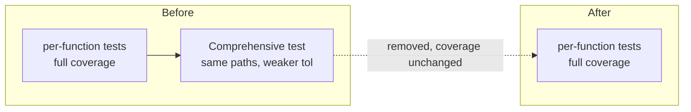

# Dedupe the CI test suite: remove duplicate & redundant tests

## Summary

Removes/consolidates provably-redundant unit tests in the heaviest test files
named by the issue, with **no src coverage regression** and **no change to
`src/**`** (test-only PR). Closes #3172.

Part of #3169 (speed up the CI test suite). Scope kept tight to the prioritised
heavy files so the change is easy to review and coverage-safe; broader
file-by-file dedup remains available as follow-up within the same milestone.

### What changed

| File                                        | Before         | After | Removed                                                      |
| ------------------------------------------- | -------------- | ----- | ------------------------------------------------------------ |
| `test/wasm/WasmUnSquash.ts`                 | 36 `Deno.test` | 35    | "Comprehensive roundtrip test"                               |
| `test/wasm/WasmDerivative.ts`               | 35 `Deno.test` | 34    | "Comprehensive comparison with JS implementations"           |
| `test/discovery/BatchDiscoveryValidator.ts` | 13 `Deno.test` | 10    | 3 config tests merged → 1; cache test folded into stats test |

Net: **−5 top-level `Deno.test` cases**, **~377 fewer lines**. The two removed
"comprehensive" tests each looped hundreds of redundant assertions per run, so
the executed-assertion reduction is far larger than the case count suggests.

### Each removed/merged test and the test that now covers it

- **`WasmUnSquash.ts` → "Comprehensive roundtrip test"** — removed. It ran a
  `wasmSquash`→`wasmUnSquash` roundtrip for Identity, LeakyReLU, LOGISTIC, TANH,
  Softsign, Complement, Cube and BipolarSigmoid at tolerance 5%. Each of those
  types already has a dedicated per-function test (`WASM UnSquash: <type>`) that
  calls `testRoundtrip` over an equal-or-wider value set with an
  equal-or-tighter tolerance (1%), covering the same TS wrapper path.
- **`WasmDerivative.ts` → "Comprehensive comparison with JS implementations"** —
  removed. It compared `wasmDerivative` against `jsImpl.derivative` for all 32
  activation types. Every type already has a dedicated per-function test
  (`WASM Derivative: <type>`) performing the identical `assertClose` comparison
  over an equal-or-wider value set with the same tolerance.
- **`BatchDiscoveryValidator.ts` → three `isEnhancedValidationEnabled` tests**
  ("disabled by default", "enabled when holdout is configured", "enabled when
  brittleness is configured") — merged into one table-driven test
  ("`isEnhancedValidationEnabled reflects config`") using `t.step()`, one step
  per former case. Same three code paths, same assertions.
- **`BatchDiscoveryValidator.ts` → "uses validation cache to avoid redundant
  validations"** — folded into "provides validation statistics". Both used the
  identical two-synapse discovery + `validateBatch` + `getStats` setup; the
  cache test's only unique assertion (`results.every(r => r.valid)`) is now
  asserted in the statistics test.

`ComplexCreatureIntegration.ts` (also named in the issue) was reviewed but left
unchanged: its 8 tests exercise genuinely distinct integration scenarios
(`runInference` vs `trainWithPredictiveCoding` vs `trainDir`, forward-only vs
recurrent, small vs production-scale topology) with different configs, so none
is a provable subset of another. Removing any would drop coverage.

## Evidence

Backend/test-only change — no UI to screenshot. Coverage held is proven by
running `deno coverage` on the affected src modules with the original tests vs
the deduped tests:

| Module                                            | Original (branch/line/… ) | Deduped               |
| ------------------------------------------------- | ------------------------- | --------------------- |
| `src/discovery/BatchDiscoveryValidator.ts`        | 75.6 / 78.9 / 69.4        | 75.6 / 78.9 / 69.4    |
| `src/wasm/mod.ts` (WasmUnSquash + WasmDerivative) | 100.0 / 100.0 / 100.0     | 100.0 / 100.0 / 100.0 |

Identical before and after → no coverage regression (the removed comprehensive
tests only re-exercised TS wrapper functions already covered by the retained
per-function tests; the activation math itself lives in WASM, not TS lines).

Quality gates run:

- `./quality.sh --lint-only` — pass (fmt 1993 files, lint 1741 files, bash ok).
- `./quality.sh --check-only` — pass (full-tree type-check).
- `deno test test/wasm/WasmUnSquash.ts test/wasm/WasmDerivative.ts
  test/discovery/BatchDiscoveryValidator.ts`
  — pass (35 + 34 + 10 cases, 0 failed).

## Test Plan

- Ran the three edited files: all pass (`WasmUnSquash` 35, `WasmDerivative` 34,
  `BatchDiscoveryValidator` 10 passing with 3 steps).
- Verified src coverage of the affected modules is byte-for-byte identical
  before and after via `deno coverage` (stash original → measure → restore).
- Full-tree `deno lint`, `deno fmt --check`, and `deno check` pass.
