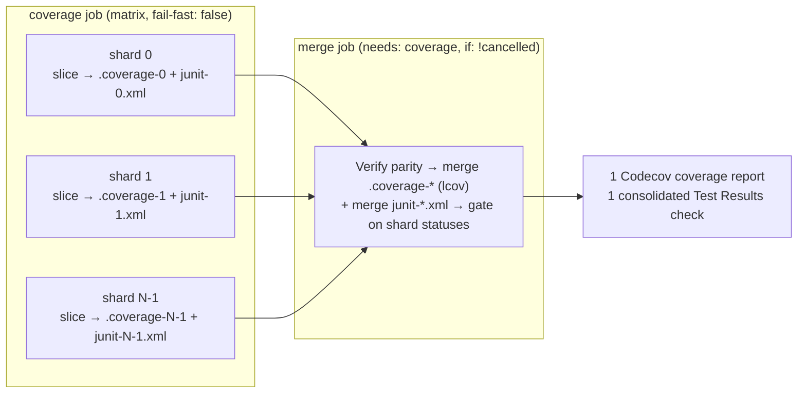

# Parallelise the coverage run via a CI shard matrix

## Summary

`.github/workflows/coverage.yaml` previously ran the entire ~1k-file test suite
in a single job, which was the heaviest, slowest step in CI and had repeatedly
brushed against its timeout. This PR fans the suite out across a **parallel
shard matrix** and merges the partial results, cutting wall-clock time roughly
in proportion to the shard count. Closes #3173.

`deno test` has no native `--shard` flag, so the new
[`scripts/shard_test_files.ts`](../../scripts/shard_test_files.ts)
deterministically partitions the sorted `test/**/*.ts` list round-robin across
`SHARD_TOTAL` shards: shard `s` runs every file whose sorted index `i` satisfies
`i % SHARD_TOTAL === s`. Because the list is sorted first, the mapping is
deterministic and every file is assigned to **exactly one** shard — no gaps, no
double-runs — and slice sizes stay balanced to within one file.

Each matrix shard runs its slice with per-runner heap/parallelism sizing and a
single OOM retry (the pre-shard job's resilience, per shard), producing a
partial `.coverage-<shard>` dir + `junit-<shard>.xml` + a `shard-status` marker,
all uploaded as a per-shard artifact. A new **merge** job then:

- re-verifies partition parity (the CI file-count parity gate);
- merges `.coverage-*` into a single `.coverage.lcov` via `deno coverage` and
  uploads **one** report to Codecov;
- merges `junit-*.xml` into a single `junit.xml` via
  [`scripts/merge_junit.ts`](../../scripts/merge_junit.ts) for **one**
  consolidated EnricoMi "Test Results" check + Codecov test-results upload;
- fails the build if any shard reported test failures or a runner crash.

Preserved behaviour: concurrency-cancel (#2842), least-privilege permissions
(#2706), the skipped Rust-discovery tests (`NEAT_RUST_DISCOVERY_OPTIONAL`), the
dynamic memory sizing + OOM retry, and fail-on-test-failure gating. Smaller
shards also reduce per-job memory pressure, though the OOM root-cause fix
remains a separate sub-issue as noted in the issue.

### Acceptance criteria

- ✅ Every `test/**/*.ts` runs exactly once across the matrix — enforced by
  `verifyShardCoverage` (unit-tested against the real suite) and re-asserted in
  CI by the merge job's `--verify` parity gate.
- ✅ Merged coverage matches a single-run report — `deno coverage` merges the
  partial dirs into one lcov (verified locally, see Evidence).
- ✅ Total wall-clock materially lower — the suite now runs on 8 shards in
  parallel instead of one serial job.
- ✅ One consolidated Test Results check + one Codecov coverage report — the
  merge job merges JUnit into a single file and uploads a single lcov.

## Evidence

This is a CI/build change (no web UI to screenshot). Verified locally:

- **Partition parity** against the real suite:
  `deno run --allow-read scripts/shard_test_files.ts --verify --total=8` →
  `OK: 1079 files covered once across 8 shards`. Round-robin gives ~135 files
  per shard.
- **Sharded command mechanics** on bash 3.2 (macOS) and via the workflow's
  portable read-loop: a 2-file shard slice fed to
  `deno test -A --coverage=.coverage-<n> --reporter junit <files>` produced a
  valid `<testsuites …>` report and populated the coverage dir.
- **Multi-dir coverage merge**: `deno coverage .coverage-0/ .coverage-1/ --lcov`
  merged two partial dirs into one lcov report.
- **JUnit merge**: `scripts/merge_junit.ts` collapses N per-shard reports into a
  single `<testsuites>` root with recomputed aggregate counts.

### Sharded workflow flow

## Test Plan

New tests (all call real functions with real data):

- `test/scripts/ShardTestFiles.ts` — round-robin covers every file exactly once,
  balanced slices, determinism, out-of-range arg rejection, `collectTestFiles`
  discovers the real suite, and a real-suite `verifyShardCoverage(files, 8)`
  parity check (mirrors the CI gate).
- `test/scripts/MergeJunit.ts` — merges to a single `<testsuites>` root, keeps
  every child suite, recomputes aggregate counts, ignores blank inputs, and
  `countJunitFailures` sums failures/errors.
- `test/ci/CoverageShardMatrix.ts` — asserts the workflow declares a shard
  matrix with `fail-fast: false`, that `SHARD_TOTAL` equals the matrix length
  (parity), that shard indices are exactly `0..N-1`, and that a `merge` job
  depends on `coverage` and runs unless cancelled.

Existing workflow-shape gates still pass (timeouts, concurrency, action pinning,
least-privilege permissions), and `actionlint` reports no issues on the
rewritten workflow.
