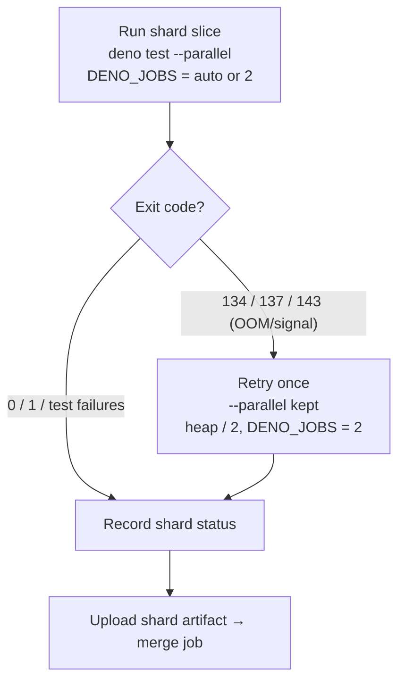

# Fix the OOM serial-fallback so the coverage suite stays parallel

## Summary

The per-shard coverage runner used to react to an OOM / termination signal (exit
`134` / `137` / `143`) by re-running the **entire shard serially** — it dropped
`--parallel` altogether. On a heavy shard that serial re-run blows the job
timeout, which is exactly the slow path Issue #3174 targets.

This change keeps the common path parallel and makes OOM recovery _scoped_
instead of serial:

- `deno test` is now **always** invoked with `--parallel`. Worker count is
  controlled purely by the `DENO_JOBS` environment variable (empty = auto, one
  worker per core).
- The memory-constrained runner tier no longer drops `--parallel`; it caps the
  worker count to `2` (still parallel), so a tiny runner bounds peak heap
  without going serial.
- On an OOM/termination signal the shard retries **once, still parallel**, with
  a halved V8 heap **and** a capped worker count (`RETRY_JOBS=2`) so at most two
  heavy test files share the heap at a time. Recovery is scoped to this shard's
  ~1/8 slice — never a whole-suite serial re-run.

Sharding itself (Issue #3173, already merged) reduced per-job memory pressure;
this fix complements it and holds with or without sharding.

Closes #3174.

## Peak-memory offenders (profiling)

Profiled with `/usr/bin/time -l deno test -A --no-check <file>` on the current
tree (peak resident set size per file, run in isolation):

| Test file                              | Peak RSS   |
| -------------------------------------- | ---------- |
| `test/creature/CreatureTrainEvolve.ts` | **793 MB** |
| `test/creature/evolveRL_test.ts`       | 412 MB     |
| `test/creature/EvolveEnv.ts`           | 319 MB     |
| `test/NEAT/NeatBehavioural.ts`         | 263 MB     |
| `test/creature/ShallowClone.ts`        | 215 MB     |
| `test/CRISPR/CRISPRCycling.ts`         | 206 MB     |

`CreatureTrainEvolve.ts` dominates: it sets `globalThis.DEBUG = true`, which
forces full `creatureValidate` on every `exportJSON()` (per the AGENTS.md
serialisation hot-path note), and drives long evolutions (up to 100 000
iterations). When several 300–800 MB files land on parallel workers sharing one
V8 heap, the shard can breach the `--max-old-space-size` cap — the OOM root
cause. The fix bounds how many such files run concurrently on recovery
(`DENO_JOBS`/`RETRY_JOBS`) rather than serialising the whole shard. Deeper
per-file allocation trimming for these offenders is left as a follow-up so this
change stays low-risk with no coverage/behaviour regression.

## Recovery flow

Before this change the `134/137/143` branch re-ran the whole shard with
`--parallel` removed (serial), which is the slow path that was removed.

## Evidence

Backend/CI change — no web UI to screenshot. Verified via:

- `test/ci/CoverageOomRetryParallel.ts` (new) — parses the committed
  `coverage.yaml` and asserts the recovery invariants. Confirmed TDD red: all
  three tests fail against the pre-fix workflow (stash check) and pass after.
- `actionlint .github/workflows/coverage.yaml` → clean (also runs shellcheck on
  the embedded run script).
- `./quality.sh --lint-only` → clean (fmt, lint, bash syntax).
- Full `test/ci/*.ts` suite → 95 passed / 0 failed.

## Test Plan

- Added `test/ci/CoverageOomRetryParallel.ts`:
  - `coverage shard invokes deno test exactly once, always parallel` — asserts a
    single `deno test` invocation with `--parallel` literally on the command (no
    separate serial re-run path).
  - `coverage shard controls worker count via DENO_JOBS, not by dropping
    --parallel`
    — asserts `DENO_JOBS` is the parallelism lever.
  - `coverage shard OOM recovery narrows workers instead of going serial` —
    asserts the `134/137/143` retry caps workers via a numeric `RETRY_JOBS`.
- Existing `test/ci/CoverageShardMatrix.ts` and the rest of `test/ci/*.ts`
  continue to pass unchanged.
