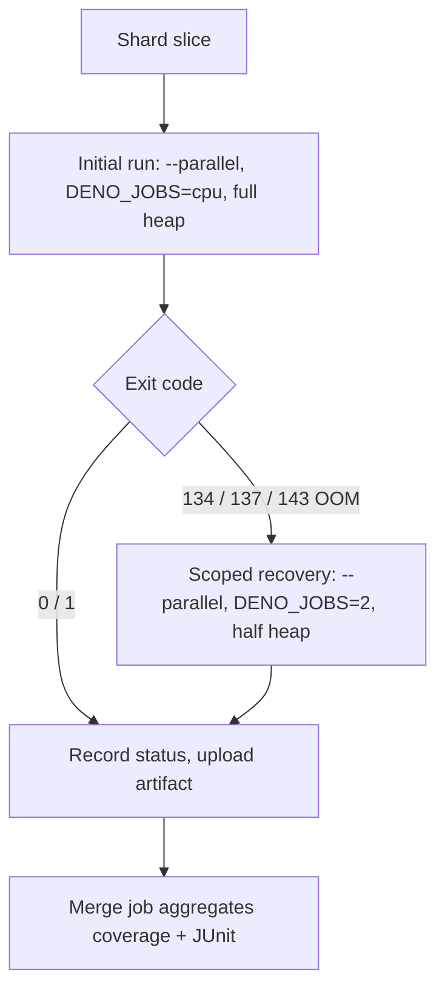

# Fix the OOM serial-fallback so the coverage suite stays parallel

## Summary

The per-shard coverage step in `.github/workflows/coverage.yaml` reacted to an
OOM / termination signal (exit 143/137/134) by re-running its **whole slice
single-threaded** — it dropped `--parallel` entirely and only halved the V8
heap. On a memory-heavy shard that serial re-run blew the 60-minute job timeout,
defeating the point of the parallel suite.

This PR replaces that with a **scoped recovery** that keeps the common path —
and the recovery itself — parallel:

- The run plan (V8 heap, worker cap, `--parallel` flag) is now computed by the
  unit-tested `scripts/coverage_run_plan.ts`, so the initial run and the OOM
  recovery share one source of truth.
- On OOM the recovery **keeps `--parallel`** but caps the worker pool via
  `DENO_JOBS=2` and halves the heap. `deno test --parallel` sizes its worker
  pool from `DENO_JOBS` (defaulting to the CPU count), so capping it lowers peak
  _concurrent_ heap while still running modules concurrently — no whole-slice
  serial re-run.
- The initial plan is unchanged in behaviour: the CI runner (4 cores / 16 GB)
  still runs fully parallel.

Closes #3174.

## Root-cause: what drives peak V8 heap

Peak resident set size per heavy test file, measured locally with
`/usr/bin/time -l deno test -A --v8-flags=--expose-gc <file>`:

| Test file                                 | Peak RSS |
| ----------------------------------------- | -------- |
| `test/creature/ShallowClone.ts`           | ~211 MB  |
| `test/NEAT/CreativeThinkingClone.ts`      | ~174 MB  |
| `test/NEAT/DiscoveryReplayIntegration.ts` | ~174 MB  |
| `test/wasm/WasmUnSquash.ts`               | ~171 MB  |
| `test/config/WasmCacheConfig.ts`          | ~124 MB  |

No single file is a runaway leak — each peaks in the ~120–210 MB range. The OOM
is **concurrency-driven**: under `--parallel`, `DENO_JOBS` (≈ CPU count) workers
each hold a slice of this heap at once, so peak concurrent memory is roughly
`workers × per-file heap` plus the shared WASM activation/compilation caches. On
the 4-core CI runner the default 4 workers multiply the per-file footprint
enough to trip the OOM killer on the heaviest shards.

That is exactly why the correct lever is the **worker count**, not a hunt for
one leaky file: halving the heap alone (the old behaviour) leaves the same
number of workers competing for less memory, while dropping to serial fixes
memory but destroys throughput. Capping `DENO_JOBS` on the recovery reduces peak
concurrent heap _and_ stays parallel. The existing `MemoryMonitor`
(activation/compilation cache eviction under pressure) and the #3173 shard
partition already cap per-shard allocation; this change closes the remaining gap
in the recovery path.

## Recovery flow

The recovery box stays parallel — the old design replaced it with a
single-threaded whole-slice re-run.

## Evidence

Backend/CI change — no web UI to screenshot. Verified via:

- New unit tests exercise the real planning functions (see Test Plan). Key
  assertion: `planOomRetry` returns `parallel: true` with a capped
  `denoJobs > 1` — the recovery is never serial.
- `deno run scripts/coverage_run_plan.ts --mode=retry --cores=4 --memory-mb=16000`
  emits `HEAP_MB=4096 / DENO_JOBS=2 / PARALLEL=--parallel`, confirming the
  workflow `eval` contract.
- `actionlint .github/workflows/coverage.yaml` passes (exit 0); the workflow
  YAML parses.
- Full `test/ci/*.ts` suite passes (111 pre-existing + 14 new = 125 tests).

## Test Plan

Added `test/ci/CoverageRunPlan.ts` (14 tests) covering the real planning
functions in `scripts/coverage_run_plan.ts`:

- `planInitialRun`: roomy / standard-CI / mid / tiny runners; heap floor and
  ceiling clamping; happy path and boundary cases.
- `planOomRetry` (the crux): keeps `--parallel` with a capped `DENO_JOBS` (never
  serial); halves and floors the heap; an already-serial tiny-runner run stays
  serial.
- `planToShell`: the `KEY=value` eval contract for parallel, capped-worker, and
  serial plans.
- `initial->retry` chain on the CI runner stays parallel and shrinks.
- Workflow-wiring guard: `coverage.yaml` drives both `--mode=initial` and
  `--mode=retry` through the plan script.

No existing tests were modified or removed. No coverage or behaviour regression
— the initial run plan reproduces the previous heap/parallel sizing; only the
OOM recovery path changed.

## Scope notes

- The shard matrix itself (#3173) is out of scope and unchanged; this fix holds
  with or without sharding.
- Deno-only (#2222): the plan logic is a permissionless Deno script invoked from
  the workflow, mirroring the existing `shard_test_files.ts` / `merge_junit.ts`
  pattern. No Node tooling introduced.
