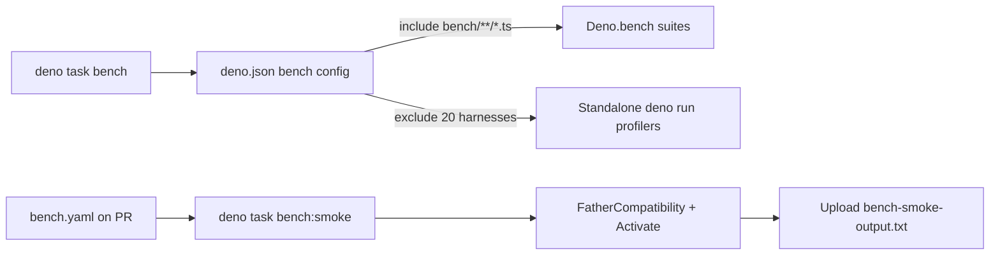

# Convert benchmark-style tests to Deno.bench and run them separately

## Summary

Closes #3175 (part of #3169).

**Verification finding first.** The issue asked to move "benchmarks disguised as
unit tests" out of `test/**` into `bench/`, listing seven candidate files — but
each had to be verified before moving. Verification showed **none of them is a
benchmark disguised as a test**:

| Candidate (`test/`)                                                     | Verdict | Evidence                                                                                                                                                                   |
| ----------------------------------------------------------------------- | ------- | -------------------------------------------------------------------------------------------------------------------------------------------------------------------------- |
| `breed/FatherPerformance.ts`                                            | Keep    | Pure correctness asserts (result equivalence, valid creatures); no timing API. Runs ~0.5s. Bench counterpart already in `bench/FatherCompatibility.ts`.                    |
| `breed/OffspringBreedPerformance.ts`                                    | Keep    | Correctness asserts (offspring validity, parents unmodified, activation equivalence); no timing API. Runs ~1.5s. Bench counterpart already in `bench/BreedPerformance.ts`. |
| `discovery/DiscoveryPerformanceSummary.ts`                              | Keep    | Tests the `formatDiscoveryPerformanceSummary` formatter output; no timing.                                                                                                 |
| `ErrorGuidedStructuralEvolution/DiscoverDirectoryPerformanceSummary.ts` | Keep    | Formatter correctness; no timing.                                                                                                                                          |
| `docs/PerformanceGuide.ts`                                              | Keep    | Verifies documented behaviour (cache-stats shape, WASM correctness, shallowClone equivalence); no timing.                                                                  |
| `bench/EvolutionPaceLeverComparison.ts`                                 | Keep    | Fast unit test of the harness that already lives in `bench/EvolutionPaceLeverComparison.ts`; deterministic/table asserts, no timing.                                       |
| `bench/ProductionScaleEvolveDirProfile.ts`                              | Keep    | Fast structural assert; production-scale profiling already in `bench/ProductionScaleEvolveDirProfile.ts`.                                                                  |

The correctness/timing split the issue asks for **had already been done** by
prior work — each file's header even points at its `bench/` counterpart. Moving
these files would delete real test coverage and cause a coverage regression, so
they correctly stay in the unit suite.

**The genuine gap** was acceptance criterion 2: the `bench/` suites were _not
runnable via any documented command or CI job_. `deno bench` only auto-discovers
`*.bench.ts` files, so the ~115 PascalCase `Deno.bench` files (e.g.
`bench/Activate.ts`) were never executed by any task or workflow. This PR closes
that gap:

- **`deno.json`** — added a `tasks` block (`bench`, `bench:smoke`) and a `bench`
  config. `bench.include` widens `deno bench` discovery to the whole `bench/`
  tree; `bench.exclude` lists the 20 standalone profiling harnesses (launched
  with `deno run`, doing heavy work at module top level) so `deno task bench`
  does not execute them.
- **`.github/workflows/bench.yaml`** — a non-gating Benchmarks workflow that
  runs `deno task bench:smoke` on PRs touching `bench/` or `deno.json`,
  uploading the output as an artifact. Kept to a small fast subset deliberately
  — the full-suite CI matrix and OOM hardening are out of scope (separate
  sub-issues of #3169).
- **`CONTRIBUTING.md` / `CHANGELOG.md`** — documented the commands and the
  config.

Acceptance criteria: (1) no benchmark-style tests were found to remove — the
listed files are genuine tests kept in place; (2) `bench/` suites are now
runnable via `deno task bench` / `deno task bench:smoke` and the CI job; (3)
behavioural assertions preserved (files unchanged); (4) no coverage regression
(nothing removed).

## Evidence

This is a backend/tooling change with no web interface to screenshot. Evidence
is the benchmark smoke pass actually running the `bench/` suites:

```text
$ deno task bench:smoke
file:///.../bench/FatherCompatibility.ts
| benchmark                                           | time/iter (avg) |  iter/s |
| --------------------------------------------------- | --------------- | ------- |
| Original (with exportJSON)                          |          3.4 ms |   294.5 |
| Optimised (direct Creature access)                  |          1.6 ms |   626.6 |
| Export overhead only (mother + father)              |         80.9 µs |  12,360 |
| Original compatibility only                         |          2.7 ms |   364.6 |
| Optimised compatibility only                        |          1.1 ms |   917.3 |
| createCompatibleFather (pre-exported, key gen only) |          2.5 ms |   394.7 |

file:///.../bench/Activate.ts
| benchmark | time/iter (avg) |  iter/s |
| --------- | --------------- | ------- |
| Activate  |          8.9 ms |   112.3 |
```

### How the benchmark runner is wired



## Test Plan

- Added `test/ci/BenchTaskConfig.ts` (5 tests, all passing): asserts the `bench`
  and `bench:smoke` tasks exist and invoke `deno bench`; `bench.include` covers
  the tree; every `bench.exclude` path exists on disk (guards against stale
  excludes silently re-including a heavy profiler); the `bench:smoke` files
  exist; and `bench.yaml` runs `deno task bench:smoke`.
- Ran `deno task bench:smoke` — both benchmark files execute and report timings
  (output above).
- `deno fmt --check`, `deno lint`, `deno check`, and `actionlint` pass on all
  changed files. `markdownlint-cli2` reports 0 errors.
- Confirmed the seven listed candidates still pass and run fast (≤~1.5s each),
  well within the ≤120s-per-test budget.
