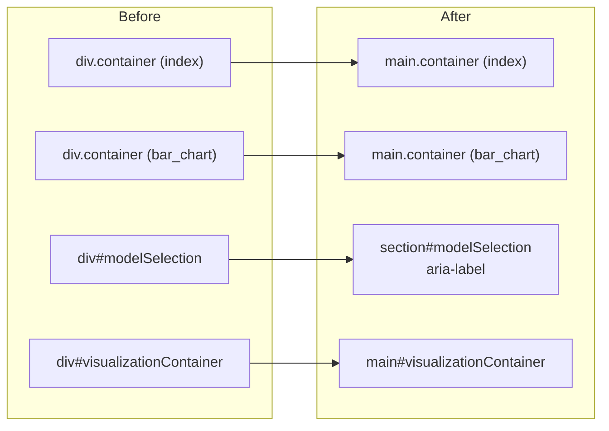

# Wrap docs pages in a `<main>` landmark for accessibility

## Summary

The three documentation pages wrapped their primary content in a generic
`<div class="container">` with no `<main>` landmark, so keyboard and
screen-reader users had no "skip to content" target and had to traverse the
whole document linearly (bucket guide check 6 requires exactly one `<main>`
per page). This change promotes the primary content wrapper on each page to a
`<main>` landmark while preserving the Bootstrap `container` classes, so there
is no visual change. `Closes #3186`.

Changes:

- `docs/index.html` — `div.container` → `main.container`.
- `docs/visualize/bar_chart.html` — `div.container` → `main.container`.
- `docs/visualize/concentric_chart.html` — the primary/active
  `#visualizationContainer` view becomes the single `<main>`; the secondary
  model-selection view (`#modelSelection`) becomes a labelled
  `<section aria-label="Model selection">` rather than a generic `<div>`.

All container `id`s and Bootstrap classes are unchanged, and the page scripts
address these elements via `getElementById` / `classList` (tag-agnostic), so
behaviour is identical.



## Evidence

This is a semantic-only markup change (element tag swap) with identical
rendered output — the Bootstrap `container`/`container-fluid` classes and all
element `id`s are preserved, so there is no visual difference to screenshot,
and the Playwright MCP browser was unavailable in this run. The accessibility
guarantee is verified behaviourally by the new test, which reads each
committed HTML file and asserts it exposes exactly one `<main>` landmark
wrapping real content:

```
docs/index.html exposes exactly one <main> landmark ... ok
docs/visualize/bar_chart.html exposes exactly one <main> landmark ... ok
docs/visualize/concentric_chart.html exposes exactly one <main> landmark ... ok
ok | 3 passed | 0 failed
```

## Test Plan

- Added `test/docs/DocsMainLandmark.ts` — for each docs page, reads the actual
  committed HTML and asserts exactly one `<main>` opening tag, exactly one
  `</main>` closing tag, and that the landmark wraps non-empty content. The
  test failed against the unfixed pages (0 `<main>` found) and passes after
  the fix.
- Ran the full `test/docs/` suite: 75 passed, 0 failed.
- `deno fmt --check`, `deno lint`, and `deno check` pass on the new test.
