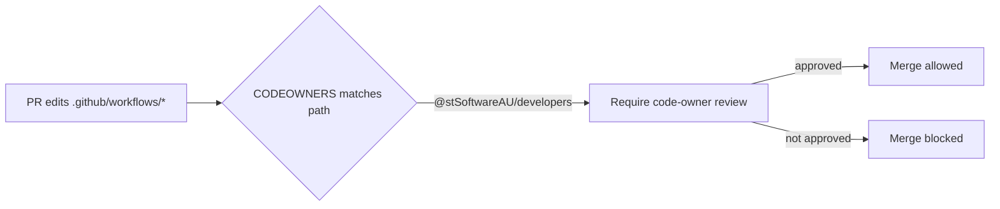

# PR Summary — Issue #3187

## Summary

Add a `CODEOWNERS` file that requires a trusted reviewer on every change to the
privileged CI/CD surface, closing a `severity:high` repo-level governance gap.
No `CODEOWNERS` file previously existed in any of the three locations GitHub
recognises, yet several workflows run with credentials well beyond
`GITHUB_TOKEN` — `publish.yml` / `pages.yml` request `id-token: write` (JSR OIDC
/ Pages), and `quality.yml` / `update-package-version.yml` expose the
write-scoped `ACTIONS_PUSH` PAT. Without an owner rule, a single careless or
compromised account could open a PR that quietly edits a workflow which then
exfiltrates those secrets the moment CI fires. Requiring a named code owner's
review closes that poisoned-pipeline path. Closes #3187.

### Owner team choice

The issue suggested `@stSoftwareAU/maintainers`, but that team **does not
exist** in the org (available teams: `ai-users`, `developers`, `service`,
`support`, `system-admin`, `vibe-coders`). A CODEOWNERS rule naming a
non-existent team is silently ignored by GitHub and enforces nothing. Only
`developers` and `vibe-coders` have push access to NEAT-AI, and `vibe-coders` is
the automation account — so the human maintaining team
**`@stSoftwareAU/developers`** is used.

### Branch-protection recommendations (repo settings, outside the tree)

CODEOWNERS enforcement additionally requires the default branch to enable
**Require review from Code Owners**. These are repository settings that cannot
be committed to the tree, so they are documented as an admin runbook in the new
[`docs/REPO_GOVERNANCE.md`](../../REPO_GOVERNANCE.md) (with a ready-to-run
`gh api` snippet):

- Enable **required review** so CODEOWNERS approval is enforced before merge.
- Block **direct push and force-push** to the default branch.
- Enable **linear history** if the team uses a rebase/squash workflow.
- Consider **required signed commits**.

The change also adds a bullet to [`SECURITY.md`](../../../SECURITY.md)
documenting the code-owner control alongside the other supply-chain defences,
and links the new governance doc from the docs index.

## Evidence

Backend/governance change — no web UI to screenshot. Verified via TDD: the new
test suite fails without the CODEOWNERS file and passes with it.

Red proof (file temporarily removed):

```
CODEOWNERS file exists in a recognised location (Issue #3187) => FAILED
CODEOWNERS covers the workflows directory (Issue #3187) => FAILED
CODEOWNERS covers the composite actions directory (Issue #3187) => FAILED
every CODEOWNERS owner is a valid @user or @org/team (Issue #3187) => FAILED
FAILED | 0 passed | 4 failed
```

Green (file present):

```
ok | 5 passed | 0 failed
```



## Test Plan

- Added `test/ci/CodeownersWorkflowsCoverage.ts`:
  - `CODEOWNERS file exists in a recognised location` — asserts the file is
    present in `CODEOWNERS`, `.github/CODEOWNERS`, or `docs/CODEOWNERS`.
  - `CODEOWNERS covers the workflows directory` — `.github/workflows/*` resolves
    to at least one owner (last-match-wins semantics).
  - `CODEOWNERS covers the composite actions directory` — `.github/actions/*`
    resolves to at least one owner.
  - `every CODEOWNERS owner is a valid @user or @org/team` — every owner token
    matches `@user` / `@org/team`, so the rule actually enforces.
  - `CODEOWNERS does not reference the non-existent 'maintainers' team` —
    regression guard for the ineffective-owner failure mode (a rule pointing at
    a team without write access is silently ignored by GitHub).
- Confirmed the suite fails against the unfixed tree (no CODEOWNERS) and passes
  once `.github/CODEOWNERS` is added.
- `deno fmt --check`, `deno lint`, and `deno check` pass on the new test.
