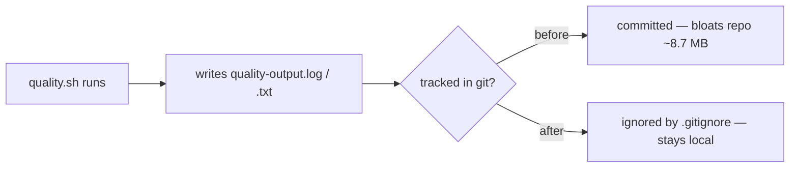

# Remove committed generated quality-output logs

## Summary

Two large, generated log files were committed at the repository root:

- `quality-output.log` — ~4.3 MB (4,322,504 bytes)
- `quality-output.txt` — ~4.4 MB (4,424,423 bytes)

Both are captured output of the repo's `quality.sh` quality gate, not source.
Committing generated artefacts bloats every clone and fetch by ~8.7 MB,
permanently inflates the pack (the blobs remain in history), produces enormous
unreviewable diffs on each regeneration, and blurs the line between source and
disposable artefact.

This change:

1. Untracks both files (`git rm --cached quality-output.log quality-output.txt`)
   and removes the stale copies from the working tree.
2. Adds a `.gitignore` rule so regenerated logs are never re-committed.
3. Adds a behavioural regression test that verifies, via git, that neither file
   is tracked and that both are ignored.

No source or workflow references these files, so nothing depends on them being
present. Should the logs be needed for CI diagnostics, the existing
`actions/upload-artifact` pattern (already used for the SBOM in `publish.yml`)
is the right home for them rather than the committed tree.

Closes #3188.

## Evidence

This is a repository-hygiene change with no web interface to screenshot.
Verification is via the new regression test and the quality gate.



New test output (`test/ci/QualityOutputLogsNotTracked.ts`):

```
generated quality-output logs are not tracked by git (Issue #3188) ... ok
root .gitignore ignores the generated quality-output logs (Issue #3188) ... ok
ok | 2 passed | 0 failed
```

The test fails against the unfixed tree (files tracked, not ignored) and passes
after the fix. `./quality.sh --lint-only` passes cleanly (formatting, lint, bash
checks).

## Test Plan

- Added `test/ci/QualityOutputLogsNotTracked.ts`:
  - `generated quality-output logs are not tracked by git` — asserts
    `git ls-files quality-output.log quality-output.txt` returns nothing.
  - `root .gitignore ignores the generated quality-output logs` — asserts
    `git check-ignore` reports both names as ignored.
- Verified `./quality.sh --lint-only` passes.
