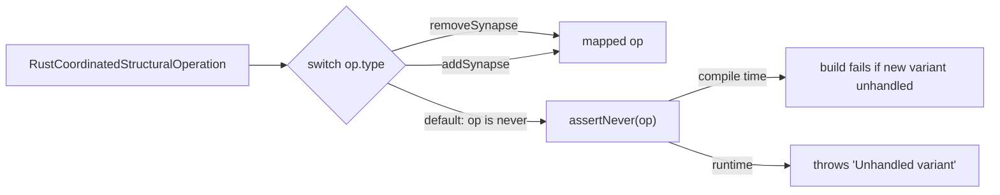

# Assert exhaustiveness in `mapRustCoordinatedOp` instead of silently casting

## Summary

`mapRustCoordinatedOp` in
`src/architecture/ErrorGuidedStructuralEvolution/DiscoverAnalysis.ts` is the
translation boundary between the Rust wire union
(`RustCoordinatedStructuralOperation`, two variants) and the TS
`CoordinatedStructuralOperation` model (seven variants). Its `default` branch
previously did `return op as CoordinatedStructuralOperation`, silently blessing
any unhandled variant through the boundary **unmapped and with no compile
error**. The day the Rust side emits a third operation (e.g. `setWeight`), that
value would slip through unmapped — a latent, hard-to-trace data-mapping bug.

This change replaces the silent cast with the project's canonical
exhaustiveness guard `assertNever` (`src/utils/assertNever.ts`), matching the
sibling file `ApplyCoordinatedStructuralCandidate.ts`. Now:

- If a new Rust variant is added and this mapper forgets to handle it, `op` is
  no longer narrowed to `never` and the build fails at the `assertNever` call —
  turning a latent runtime bug into a compile-time error.
- At runtime, malformed wire data that escaped the type system throws loudly
  ("Unhandled variant: …") rather than passing through silently.

`mapRustCoordinatedOp` was made `export`ed (following the existing
`mapRustCandidate` / `mapRustNeuronCandidate` public-mapper pattern) so its
behaviour can be exercised directly by tests.

Closes #3190.

## Change flow

## Evidence

Backend/type-safety change — no web interface to screenshot. Verified via:

- `deno test test/ErrorGuidedStructuralEvolution/MapRustCoordinatedOpExhaustiveness.ts`
  → `3 passed | 0 failed`.
- `deno check` on the changed source + test → passes, confirming the `default`
  branch still type-checks (both variants handled, so `op` narrows to `never`).
- `deno lint` and `deno fmt` clean on both files.

## Test Plan

Added `test/ErrorGuidedStructuralEvolution/MapRustCoordinatedOpExhaustiveness.ts`:

- **Happy path** — `removeSynapse` maps to the correct TS shape.
- **Happy path** — `addSynapse` maps and preserves `weight`.
- **Error path** — an unmapped variant (`setWeight`, cast past the type system)
  now throws `Error: Unhandled variant …` instead of being silently cast.
