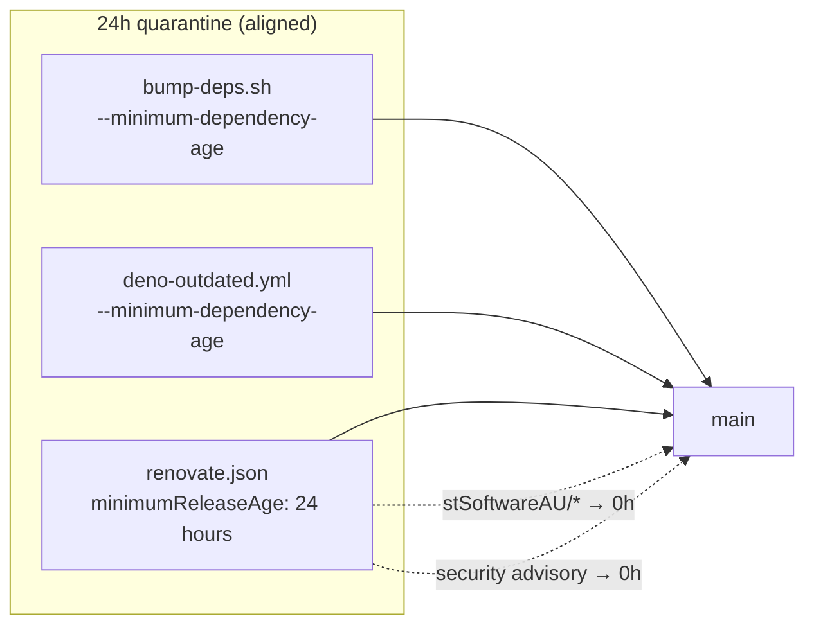

# Renovate 24h quarantine (minimumReleaseAge) — Issue #3191

## Summary

`renovate.json` enabled Renovate via `config:recommended` with **no**
`minimumReleaseAge` (nor its legacy alias `stabilityDays`), so it was an
ungated third dependency-update path alongside the two deliberately gated ones:

- `bump-deps.sh` — `deno outdated --update --latest --minimum-dependency-age`
  (default 24h via `VIBE_BUMP_QUARANTINE_HOURS`).
- `.github/workflows/deno-outdated.yml` — the same 24h window (Issue #2741).

Renovate could therefore raise a version-bump PR the moment a release is
published, inside the window the other two paths deliberately close — a
defence-in-depth supply-chain gap (A03:2025, `supply-chain:quarantine-misconfigured`).

This change makes all three paths agree by adding a **24 hour**
`minimumReleaseAge` quarantine to `renovate.json`, while:

- **Exempting internal `stSoftwareAU/*` deps** (`minimumReleaseAge: "0"` via a
  `packageRules` entry) so they still bump immediately — mirroring the
  `minimumDependencyAge.exclude` globs in `deno.json`.
- **Letting security advisories bypass the wait** — `vulnerabilityAlerts`
  keeps `enabled: true` and adds `minimumReleaseAge: "0"`, so OSV/advisory-driven
  remediation PRs are not held back by the routine quarantine.

Closes #3191.

## Update-path alignment



## Evidence

CI-config change only — no web interface to screenshot. Verified via the
"what" tests in `test/ci/RenovateConfig.ts`, which parse the committed
`renovate.json` and assert on the resulting configuration:

```
renovate.json enforces a 24h minimumReleaseAge quarantine (Issue #3191) ... ok
renovate.json exempts internal stSoftwareAU deps from the quarantine (Issue #3191) ... ok
renovate.json lets security advisories bypass the quarantine (Issue #3191) ... ok
```

`./quality.sh --lint-only` and `./quality.sh --check-only` both pass.

## Test Plan

- Added to `test/ci/RenovateConfig.ts`:
  - `renovate.json enforces a 24h minimumReleaseAge quarantine (Issue #3191)` —
    asserts the top-level `minimumReleaseAge` resolves to 24 hours.
  - `renovate.json exempts internal stSoftwareAU deps from the quarantine (Issue #3191)` —
    asserts a `packageRules` entry matches `stSoftwareAU/*` packages with a 0h age.
  - `renovate.json lets security advisories bypass the quarantine (Issue #3191)` —
    asserts `vulnerabilityAlerts.minimumReleaseAge` resolves to 0.
- Added a `durationToHours` helper so the tests assert on the resulting
  duration (24h / 0h), not on the exact string used to express it.
